# What are Support Vector Machines?
Support vector machines (SVM’s) are a type of supervised machine learning classification algorithm which aims to create a hyperplane to linearly separate two classes. The hyperplane, or decision boundary, is a line where data points on each side are given separate labels or classifications. Within datasets, there are often many possible hyperplanes which can be constructed to separate the data. The objective of SVM’s, however, is to find the hyperplane which separates the classes with the highest margin - in other words with the maximum distance from the data points.

# Large Margin Classification
The mathematics for SVM’s is complex, but begins with the simple equation for a line:

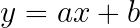

Rewriting x and y as x1 and x2, the equation for a line can be rewritten as:

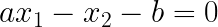

and can subsequently be vectorized with X, the training data, and W, the normal vector to the hyperplane, to obtain:

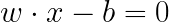

This equation is sufficient to determine a simplistic hyperplane where positive results (W*X + b > 0) from the equation correspond to the positive class and negative results (W*X + b < 0) the negative class. However, to find the hyperplane with the highest margin, SVM’s make use of “support vectors.” These are the closest input data points to the proposed hyperplane, as shown in the image below.

Consequently, these data points are critical to determining the precise position of the hyperplane and are found when +1 and -1 are utilized as the thresholds for the hyperplane. The resulting equations are:

Predict 1 when

Predict 0 when 

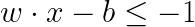

and are often combined into the following form:

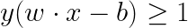

Where y represents the class +1 or -1. Given the support vectors, the goal of the math is to maximize the distance between the support vectors and the hyperplane. The equation for the distance between a point (x0, y0) and a line is given by:

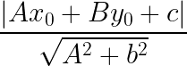

In the context of the SVM problem, this becomes:

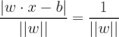

Again, this represents the distance between the support vectors and our proposed hyperplane solution. As a result, to maximize the margin between the different classes, the SVM question simplifies to minimizing ||w||. This problem is a constrained optimization problem and requires the use of the Lagrangian multiplier method, which will not be discussed here, however, many modern packages - for example, libsvm and sklearn - have built in functions to compute the optimal solution.

There is one last restriction regarding the mathematics of SVM’s. To generalize an SVM model well to external data, we often do not want to fit the SVM hyperplane precisely to the training data but allow for a limited number of “errors” or points to be classified incorrectly. This type of SVM model is called a “Soft-Margin” SVM in comparison to the “Hard-Margin” SVM discussed in prior paragraphs. The equation to minimize a Soft-Margin SVM utilizes the hinge loss function as follows:

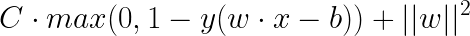

# Tuning Hyperparameters: 

## Kernel 
The math above delineates a hyperplane to linearly separate two classes, but often in datasets the classes are not easily separable by a simple linear line. For example, some classes may require curved boundaries as shown below:

The solution to this involves applying a kernel. A kernel is a function that performs high cost transformation for the user. The function takes two data points as inputs and returns a similarity score where the closer the data points are, the higher the similarity score. Kernel functions allow one to achieve scores from higher dimensions without the need to actually transform the data. As a result, the closest data points in much higher dimensions are found without the need to implement as additional functions. 
There are various kernel functions that can be used such as linear, radial basis function (RBF), and polynomial. Choosing the right kernel is crucial in determining how well one’s model performs and fits the data. 

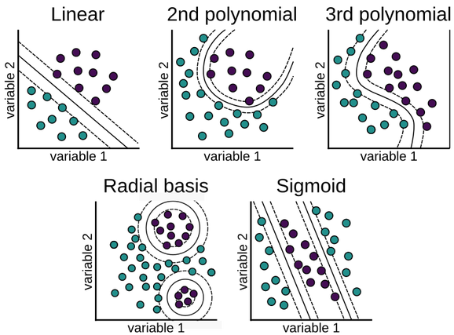

## Linear
The linear kernel works best on linear data. Compared to RBF and polynomial kernels, linear kernels don’t implicitly define a transformation to higher dimensions. Thus linear kernels are not able to form complex decision boundaries. 

## RBF
RBF kernels on the other hand, can have an infinite number of dimensions. As a result, we can use the kernel to build very complex decision boundaries. The more dimensions there are, the greater the likelihood that there is a hyperplane that is able to neatly separate and classify the data. The curves are typically bell-shaped because they decrease in value as they move away from the center.

## Polynomial
Like with RBF, the polynomial kernel allows the user to define a transformation to higher dimensions. The polynomial kernel allows us to learn patterns in our data as if we had access to the interaction features (a², b², ab, etc.). However, it is much more difficult to choose which polynomial kernel (quadratic, trinomial, etc.) to use so that the model performs at its best. Thus RBF is likely the better choice. 

## Sigmoid
The sigmoid kernel is based on the concept of neural networks. Like in neural networks, the sigmoid kernel is used as an activation function (equations that are used in a neural network to determine the output). In practice the sigmoid kernel has done well but like with any model requires tuning and refining. 

## Regularization
The regularization parameter (C) is the misclassification term and used to tell the algorithm how much one care about misclassifying points when training the model. With this term, one can control the trade-off between decision boundary and misclassification term. Typically if C is higher, the optimization will choose a smaller margin hyperplane, so the misclassification rate will be lower, whereas if the C is lower, the margin will be bigger and have a higher misclassification rate. It is important to keep in mind that overfitting can occur when C  is high and when all the training data is classified correctly since this does not necessarily mean that the precision of the model was increased. 

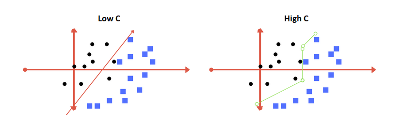

## Gamma 
Gamma defines the influence a single training example has. High values of Gamma will consider points close to the hyperplane while low Gamma values will consider points farther away from the hyperplane. As a result, higher values of Gamma will loosely fit the training dataset, whereas a lower value of gamma will tend to exactly fit the training dataset, which causes overfitting. 

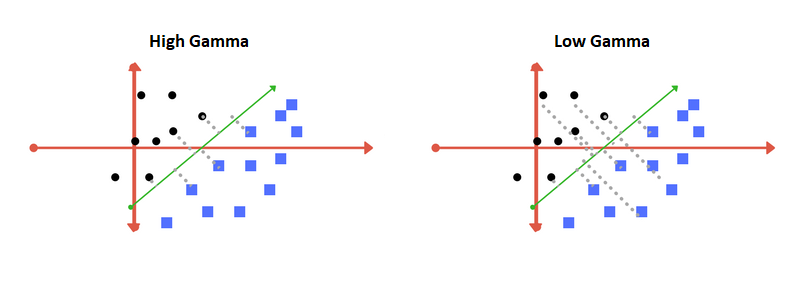

These observations may not always apply in every implementation of SVMs, thus it’s important to tune parameters to one’s specific model by trying out different parameters to find those that allow the model to optimally perform. Overall parameter tuning is necessary to refine SVMs that make sense to the problem one is working to solve. 
	
# Advantages and Disadvantages of SVM
Because of the necessity to maximize the margin of separation, SVM performs extremely well when the margin of separation is clear, the dataset is relatively small, and contains little noise. Overlapping data points from different classes will make it difficult for SVM to find the optimal support vectors and consequently, the hyperplane. While SVM still works well when the number of features exceeds the number of training data, if the proportion becomes too large the bias from the regularization parameter will dominate the SVM equation and cause overfitting. Because of the different parameters needed to tune, SVM allows for versatility in fine-tuning but unless these are set correctly, the model will fail to achieve the optimal classification performance. The same parameters do not generalize across classification models and will need to be optimally re-tuned for every situation.

# Practical Implementation in Bioinformatics
SVM’s are a powerful tool when it comes to any classification problem. Notably, in bioinformatics SVM’s have been used for gene/cell classification, recognition of protein sequence homologs, and cancer diagnostic. These fields generally have vast amounts of data to train the model, and given the relative computational efficiency of SVM’s along with its robustness at higher dimensions, many bioinformatics have been turning to SVM’s as one of the standard classification tools. Specifically in oncology, SVM’s have been utilized as early as 1999 with consistently accurate results. Because SVM is a binary classifier (i.e. it can only discern two classes with its hyperplane) and cancer diagnostics sometimes requires determining between many subtypes, SVM’s are often modified utilizing the “one-vs.-all” approach. This method recognizes one of the classes as the positive class and groups all remaining classes into the negative class.
SVM is also utilized in predicting polystyrene binding peptides (PSBPs). Polystyrene with PSBPs “can be used to immobilize bioactive peptides, enzymes and antigens in water at room temperature”(Meng). This is an important step of the immobilization process that the “medicine, textile, and automobile”(Meng) industries rely on. The problem being that “it is time-consuming and expensive to use a wet experiment to verify these peptides”(Meng). A solution is the creation of an SVM model that recognizes PSBPs, which requires three steps to prepare the dataset for training the SVM. 

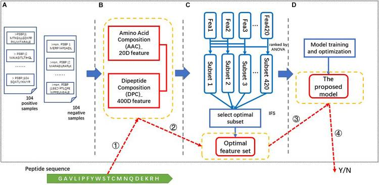

The first step is data collection. This study utilizes “104 positive samples (PSBPs) and 104 negative samples (non-PSBPs)”(Meng). The samples are taken from the BDB database and undergo various checks that filter out the data such as peptides with “ambiguous characters” or “non-alphabetic characters”(Meng) being removed.The second step is Feature Extraction, where the amino acid composition(AAC) and dipeptide composition(DPC) were selected to be the “discrete extraction feature”(Meng). The AAC being 20-dimensional since the “a peptide consists of 20 kinds of amino acid residues”(Meng) and the DPC being 400-dimensional since there are 400 combinations of two different amino acid residues. The third step is Feature Selection, where they use an ANOVA ranking system algorithm and incremental feature selection algorithm to optimize the feature set.The optimized feature set is then used to train the SVM classifier model.

More recently, SVM is being utilized in the early detection of Melanoma, “the most dangerous form of skin cancer”(Afifi). The SVM used is a cascade SVM classifier, which is a type of SVM that divides the training set into smaller subsets for faster computing. Two SVM models are trained for a two-stage classification of the data. The purpose of the second model being to “decrease the risk of false detection by reducing the number of false negatives”(Afifi). Thus, improving the accuracy of the first model. This can be seen in the model below.

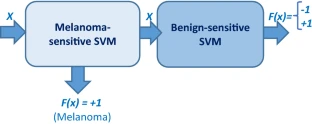

The models are trained by using “pre-processing, segmentation, and feature extraction (based on HSV color channels) algorithms”(Afifi) on 356 images in order to extract “356 instances of 27 features each” (Afifi). Model M being trained with more melanoma samples and model N being trained with more benign samples, as seen in the table below.

| SVM Model       | Melanoma Training Set   | Benign Training Set|  SVS     | Accuracy % |
| :------------- | :----------: | -----------: |-----------: |-----------: |
|  Model M | 100   | 44    | 61 | 97.92 |
| Model N   | 67 | 144 | 139 | 72.51 \| |

It is feasible for the SVM models to, one day, be embedded in a “low-cost handheld medical scanning device for early melanoma detection”(Afifi). 

# Works Cited

https://towardsdatascience.com/support-vector-machine-introduction-to-machine-learning-algorithms-934a444fca47

https://www.ncbi.nlm.nih.gov/pmc/articles/PMC5822181/

https://www.mlsurveys.com/papers/125.pdf

https://heartbeat.fritz.ai/understanding-the-mathematics-behind-support-vector-machines-5e20243d64d5

https://fderyckel.github.io/machinelearningwithr/svm.html

http://web.mit.edu/6.034/wwwbob/svm-notes-long-08.pdf

https://link.springer.com/article/10.1007/s00521-018-3656-1

https://www.ncbi.nlm.nih.gov/pmc/articles/PMC7137786/ 

https://dhirajkumarblog.medium.com/top-4-advantages-and-disadvantages-of-support-vector-machine-or-svm-a3c06a2b107

