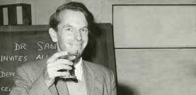
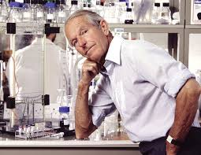
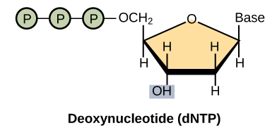
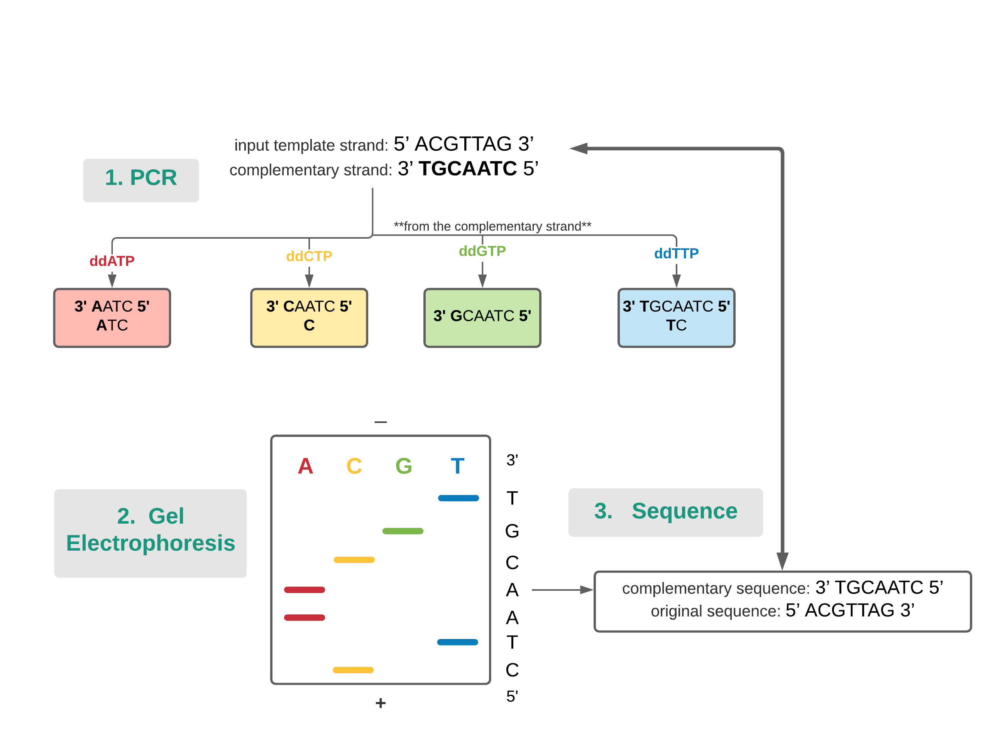
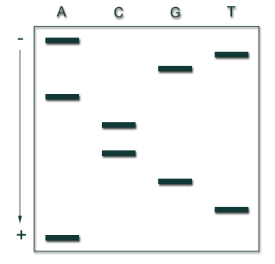

# Sanger Sequencing

---
Group 12: Hyo Kim, Chris Jiang, Sarah Ki

BENG 183: Final Paper

University of California, San Diego

---

## Overview

1. [Background](#background)
2. [History](#history)
3. [Beginning of First Generation DNA Sequencing](#beg)
4. [Molecular Biology](#bio)
5. [Preparing for Sanger Sequencing](#prep)
6. [Overview of Sanger Sequencing](#sanger)
7. [Practice Problem](#practice)
8. [Relevance of Sanger Sequencing](#relevance)
9. [Citations](#citation)

## I. Background 
Sanger Sequencing uses principles of DNA replication and deoxynucleoside
triphosphates (dNTP) in order to make use of dideoxynucleoside triphosphates
(ddNTP). dNTP includes dATP, dTTP, dCTP and dGTP. To give a brief overview, DNA
replication occurs when helicase first unwinds the DNA strand into two separate
strands by breaking the hydrogen bonds between the base pairs. Afterwards,
primase attaches to the strands and the primer is placed. This allows DNA
polymerase to attach, add dNTPs to the two strands, and ultimately replicate
DNA. DNA replication is terminated once a ddNTP is added since it lacks a
hydroxyl group.

## II. History 
Frederick Sanger was born in England on August 13, 1918 and enrolled in
Cambridge University where he majored in chemistry and physics. After
graduating, Sanger worked on research in lysine and sequencing insulin, where he
developed new methods to read amino acid sequences using chemistry and
chromatography. In 1962, Sanger joined the Medical Research Council to research
and sequence DNA. He used previous research in sequencing insulin in order to
develop a new sequencing technique, the Sanger Method. In 1977, Sanger and his
colleagues published the sequence of a virus genome. In 1980, Sanger won the
Nobel Prize and his new technique has been automated and used in the Human
Genome Project.

## III. Beginning of First Generation DNA Sequencing 
Sanger and other researchers were aware of the fact that DNA sequences store
unique biological information and biochemical properties of life [2], it
remained a challenge to invent a method to order the nucleotides given a sample
DNA.
Prior to 1970s, there were a couple of discoveries that were widely accepted
during this time:
1. DNA has a double helix structure with complementary strands going in opposite
directions
2. DNA is consists of nucleotides (dNTPs)
  - the acronym N can refer to Adenine (A), Cytosine (C), Thymine (T), or
Guanine (G)
  - ex: dATP → Adenine

  - ex: dGTP → Guanine

  

3. DNA require a DNA polymerase and DNA primer to replicate
  - A primer is a short RNA nucleotide sequence that marks the beginning of DNA
replication. Primer acts as a salient ingredient since DNA polymerase can link
one nucleotide to another only when there are pre-existing nucleotides attached
to the DNA template. DNA polymerase adds nucleotides (dNTPs) and finishes the
elongation process. When the DNA polymerase finishes the elongation process,
there is a new complementary DNA strand [4].
4. DNA has a negatively charged backbone due to the 5’ Phosphate group
  - Phosphate group is attached to the 5’ Carbon of the deoxyribose. The
phosphate group is naturally negatively charged. Since neither the deoxyribose
nor nucleic acid attached to the deoxyribose are charged, the negative charge of
the phosphate group dominates the overall charge of DNA. In simpler terms, DNA
has a negatively charged backbone.[5]

## IV. Molecular Biology 
#### - Structure of ddNTP and dNTP
  - In natural DNA replication, DNA polymerase adds dNTP. dNTP, or
deoxynucleoside triphosphate, is consistent with three phosphate groups,
deoxyribose, and base (A, C, T, or G). A natural dNTP has a hydroxyl group-- or
OH group-- attached to the 3’ carbon of deoxyribose. A hydroxyl group group acts
as a very important property in Sanger Sequencing. A DNA polymerase can add a
nucleotide to an extending strand only with the presence of a hydroxyl group.
This means that hydroxyl groups act as a link between one nucleotide to the
phosphate group of the next nucleotide. The structure of ddNTP-- or
dideoxynucleoside triphosphate--  is very similar to dNTP. Like dNTP, ddNTP has
three phosphate groups and a base; however, it is modified in a way that the 3’
hydroxyl group is replaced with a hydrogen group-- H. Like mentioned before, the
3’ hydroxyl group acts as a link between one nucleotide to the nucleotide. Since
the structure of dNTP and ddNTP are very similar, DNA polymerase can
successfully add ddNTP to the elongated strand. However, **when ddNTP is added
to the strand, the entire elongation process stops since the polymerase cannot
add neither dNTP or ddNTP to the strand**. This is due to the fact that **ddNTP
lacks a 3' hydroxyl group on ddNTP**.

  - Sanger used this idea to sequence DNA. In his experiment, he added dNTP and
ddNTP when simulating the process of DNA replication. Whenever DNA polymerase
adds a fluorescently labeled ddNTP to the growing strand, the elongation process
will end. This will fragment the DNA into various lengths. For example, if the
template DNA had a length of 100 base pairs, the fragment length will be varying
from 1, 2, 3,…, 100.

  

#### - Phosphate Backbone
  - Once a nucleotide has been incorporated into DNA strand, nucleotides lose
two of their phosphate groups. The remaining phosphate group on the nucleotide
is attached to the 5’ end of the nucleotide. The 5’ phosphate group forms an
ester bond with the 3’ hydroxyl group of an adjacent nucleotide. The continuing
chain of linking phosphate group with 3’ OH group will form a phosphate backbone
of a DNA strand. Since phosphate groups are negatively charged and all the
different molecular components of DNA are uncharged, DNA is, overall, negatively
charged.[6]
  - Sanger used this idea in his method. Since positive and negative charges
attract, when a positive charge is near a DNA fragment, the DNA fragment will
travel towards the positive side. Using this method, Sanger used gel
electrophoresis to separate the DNA fragments depending on their sizes. The
larger the fragment, the slower it will travel. This means that larger fragments
will be closer to the negative side of the gel electrophoresis compared to
smaller fragments. For example, if DNA fragment A is around 500bp and DNA
fragment B is around 100bp, the fragment B will travel farther and faster down
the gel electrophoresis compared to fragment A.

  

## V. Preparing for Sanger Sequencing 
### Ingredients:
   1. Single stranded DNA Template: A Single Stranded DNA template holds the DNA
information  in which we want to sequence
   2. DNA primer: Short strand of RNA that acts as a starting point of DNA
synthesis
   3. Taq polymerase: extends the new DNA strand by adding complementary dNTP or
ddNTP. Taq Polymerase can withstand high temperature without losing function
during PCR
   4. dNTP: Nucleotides used in natural DNA replication (includes a 3’-OH group)
   5. ddNTP to terminate elongation: Nucleotides used during PCR (lacks a 3’-OH
group). This acts as a key factor that terminates DNA strand elongation

## VI. Overview of Sanger Sequencing 
### 3 Steps:
   1. **PCR:** In vitro DNA replication using ddNTPs with fluorescents →
produces short DNA fragments
   2. **Gel Electrophoresis:** Denature and separate the DNA fragments by size
   3. **Sequence:** Read the nucleotides by looking at the bands on gel

   

   

### Example:
   1. PCR: Given the input template strand ***5'-ACGTTAG-3'***, DNA replication
is repeated ***4 times with 4 different ddNTPs*** (ddATP, ddCTP, ddGTP, ddTTP).
Each ddNTP has a different color fluorescence, making it easier to identify the
bases later on. Each replication will generate a different set of DNA fragments
that resulted from the using specific ddNTP as shown in figure. The outcome of
this set would be short DNAA fragments that are part of the complementary
strand.
   2. Gel Electrophoresis: Given the generated DNA fragments from PCR, resulting
fragments from each replication are loaded into its respective lane in the gel.
This makes a total of 4 lanes in the same gel. After loading, electric current
is applied, and the loaded DNA will start to move towards the bottom of the gel
with small fragments traveling faster. The outcome is the gel with distinct
bands in each lane.
   3. Sequence: Given the bands in the gel, read the sequences from the bottom
to the top, with bottom being the 5' end. The lowest band is the ***C***, which
is correct since the shortest DNA fragment is ***5'-C-3'*** generated from
ddCTP. The sequence read from the gel is ***3'-TGCAATC-5'***, which is the
complementary strand of the template strand from the beginning.

  
## VII. Practice Problem 
**Question 1:** What are the products of replicating the template strand
3’-AATGCAGTA-5’ with ddATP?

**Answer:**

|Template|Gel Electrophoresis|
|:----:|:----:|
|3’-A-5’|5'-T-3'|
|3’-AA-5’|5'-TT-3'|
|3’-AATGCA-5’|5'-TTACGT-3'|
|3’-AATGCAGTA-5’|5'-TTACGTCAT-3'|

- ***TIP***: The easiest way to get the answer is to find all the fragments that
end with A (since chain was terminated using dd**A**TP).

**Question 2:** Given the gel electrophoresis result, what are the products (gel
and template strand) terminated with ddATP?

**Answer:**
1. Gel reading:
5’-ATGCCAGTA-3’
2. Template:
3’-TACGGTCAT-5’

|Template|Gel Electrophoresis|
|:----:|:----:|
|3’-TA-5’|5’-AT-3’|
|3’-TACGGTCA-5’|5’-ATGCCAGT-3’|

- ***TIP***: When reading the gel electrophoresis results, the 5' end is on the
positive side (aka bottom end) and the 3' end is on the negative side. When
reading results from the bottom to the top, you are reading from the 5' to the
3' direction.

## VIII. Relevance of Sanger Sequencing 

Sanger sequencing is still used today as it has many advantages compared to other newer methods. Sanger sequencing has a high sequencing quality rate and longer read lengths compared to NGS. However, Sanger sequencing does have slower sequencing speed compared to newer methods and the quality degrades after 700-900 base pairs [3]. Thus, this method is mainly used for validation of NGS results as well as forensic analysis.
## IX. Citations 
[1] https://www.nature.com/scitable/topicpage/frederick-sanger-method-man-
problem-
solver-6537485/#:~:text=Insulin.,Sanger%20earned%20his%20Ph.&text=Using%20chemistry%20and%20chromatography%2C%20and,Nobel%20Prize%2C%20take%20one.

[2] https://www.ncbi.nlm.nih.gov/pmc/articles/PMC4727787/

[3] https://www.news-medical.net/life-sciences/Challenges-with-Sanger-
Sequencing.aspx

[4]
https://www.nature.com/scitable/definition/primer-305/#:~:text=A%20primer%20is%20a%20short,before%20DNA%20replication%20can%20occur.

[5] https://www.genome.gov/about-genomics/fact-sheets/Deoxyribonucleic-Acid-
Fact-
Sheet#:~:text=DNA%20is%20made%20of%20chemical,phosphate%20and%20sugar%20groups%20alternating.

[6] https://www.nature.com/scitable/definition/phosphate-backbone-273/
