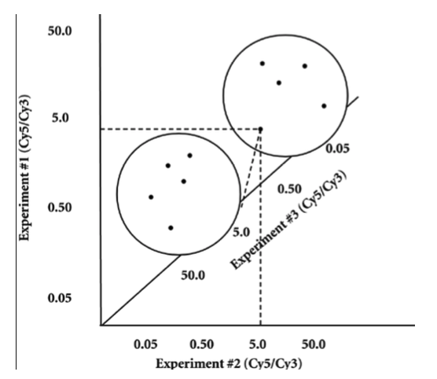
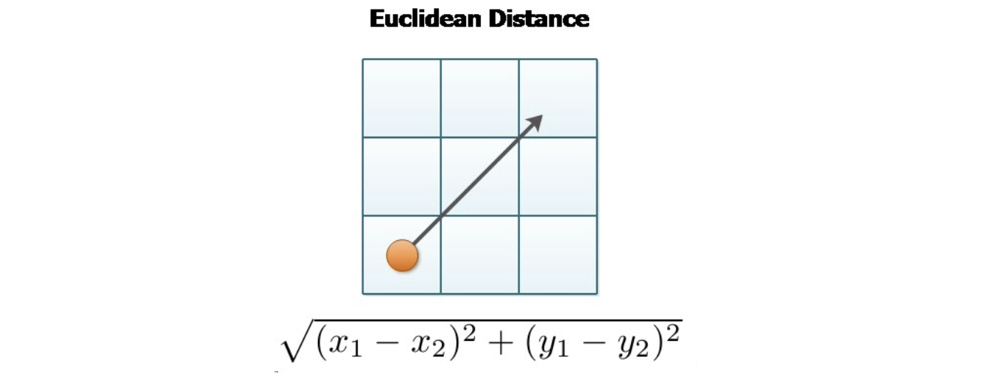
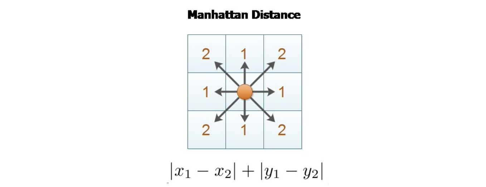
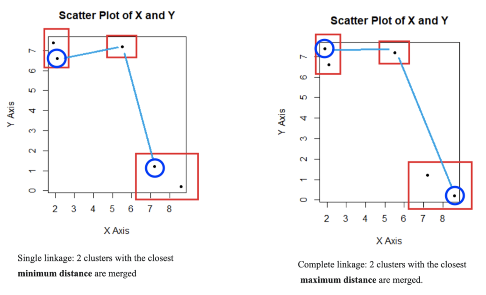
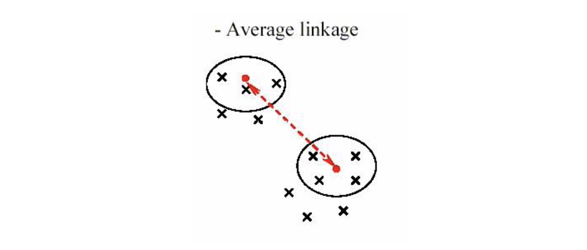
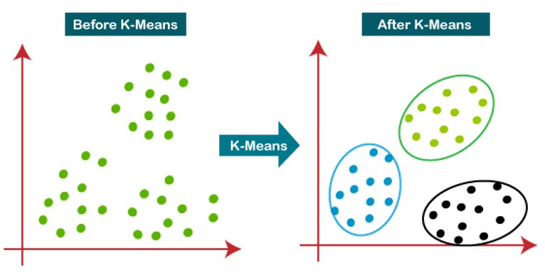
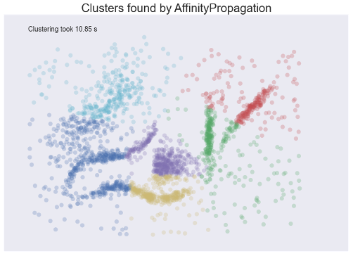
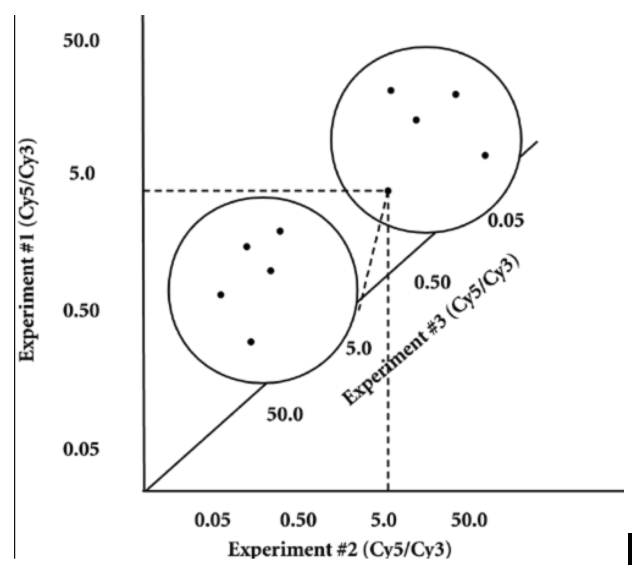

##### Final Presentation Paper

## Hierarchical Clustering

##### Yunseo Lee, Laleh Emileh, Stacy Menendez

##### Fall 2020

## Overview

Hierarchical clustering is a clustering technique that allows us to
build tree structures by grouping similar clusters based on their
similarities. Each node in the tree represents data that have the least
dissimilarity between them. By calculating the distance matrix between
the clusters, we are able to group the clusters and then visualize our
data by using a dendrogram. The height of each branch of the tree shows
the degree of similarity and dissimilarity between the clusters and the
strength of correlation \[1\]. The clusters (nodes of the tree) that are
placed in the same level in the tree are more similar to each other than
those placed on a higher or lower level. Although hierarchical
clustering is a convenient and easy way of organizing scattered data, is
it often hard to perform meaningful data analysis on the end result of
this clustering technique, especially when we are dealing with large
data. In order to have accurate dendrograms, we need to maximize the
similarities between the data in each cluster and minimize the
similarity among the clusters.

One of the challenges in hierarchical clustering analysis is the
calculation of the distance matrix. While there are many popular ways to
calculate this, using Euclidean distance and Manhattan distance, we need
to know our data inside and out in order to make a decision on which
calculating approach provides the most accurate result based on the type
and size of data we are working with.

A well designed clustering algorithm can provide an easy to understand
tree construct for the reader to draw quick and straightforward
conclusions when it comes to cluster analysis.

## Applications in Biological Sciences

Hierarchical clustering is a useful technique when we are working with
biological data. We can group genes with similar expressions into
clusters and use appropriate clustering algorithms to convert noisy
scattered data into an organized cluster tree for gene expression
profiling. Other applications in biological data analysis, including
finding gene sequence similarities among data gathered at experimental
level, identify genes that are coregulated. Additionally, they classify
independent biological pathways and build the famous phylogenetic tree.
We can also use hierarchical clustering techniques to track where a
viral outbreak originated from. Using other clustering and modeling
techniques along with hierarchical clustering often results in better
classification of data as we need to reduce the amount of noise and
number of outliers.

## Algorithm

There are **two types of basic clustering algorithms** to build our tree
structure and they are exactly reverse of each other. We can use a
bottom-up algorithm for agglomerative (or linkage) clustering or a
top-down algorithm for divisive clustering. While both use cluster
similarity to either merge or divide two clusters, divisive clustering
is a rare approach since it is more complex to partition the (global)
data, and once the division is done, we are able to reverse it.

**Divisive Clustering**

In divisive clustering, all the data points start in the same cluster
and then they are divided into smaller clusters using a **parametric
clustering algorithm** and the process is repeated until we hit the
desired number of clusters. Divisive clustering is more efficient in
case of a predetermined number of clusters we want to break our global
into.

**Agglomerative Clustering**

In Agglomerative (linkage) clustering each data point starts in its own
cluster. By using greedy algorithms, the clusters that are most similar
to each other are merged together until one cluster is formed. The merge
operation is done monotonically \[3\]. In a bottom-up algorithm we do
not need to predetermine the number of clusters, but sometimes we need
to cut the hierarchy at some point to work with only those sets of
clusters that are in the same level of hierarchy.

The following figure shows how we can use this technique to visualize
ten gene sequences with different (dissimilar) gene expressions in three
separate experiments. \[4\] Each axis represents experiment 1, 2 or 3.
Each data point is a three dimensional vector showing expression levels.
Merging similar sequences requires us to calculate the geometric
distance between each data point.

> 
  Figure 1: Different gene expressions among ten genes in three different experiments visualized in three dimensions \[4\]
  ___

After calculating the N x N similarity matrix, where N is the number of
data points (N=10 in figure1), the algorithm iteratively merges in the
most similar data points in N-1 number of steps until there is only one
vector left. In each iteration the similarity matrix needs to be stored
in the memory to be accessed in the next step and then update the
similarity matrix to be restored again. This is why this technique is
not efficient and cannot be used for large data.

It's also important to note that, how we calculate the distance matrix
for merging or dividing different clusters will have an impact on the
outcome of our algorithm as well as, our interpretation of data - as it
may introduce noise or outliers.

## Distance Measures

There are several different ways to calculate the **measure of
distance**, but for now we will focus on the most common methods - such
as Euclidean distance, Manhattan distance and Cosine Similarity.

**Euclidean distance**

Euclidean distance is the most **well-known clustering calculation
method**. It is a distance that is the length of a line between two
points within a euclidean space. It can be calculated using the
cartesian coordinates and applying it to the Pythagorean distance
formula. As a result, this will give us the magnitude of the two points.
The euclidean distance is calculated as:  .
\[[*5*](https://en.wikipedia.org/wiki/Euclidean_distance)\]

**Manhattan distance**

Manhattan distance, also called the **“taxicab” metric**, is a distance
measure that is not widely used. This measure utilizes two data points
that are found in a grid-like path. As a result, the distance is the sum
of absolute differences. The Manhattan distance is calculated as p~1~ at
\( (x1, y1) and p2 as: (x2, y2) = |X_1-Y_2 |+ ...+|X_1-Y_2 |.  \).
\[[*7*](https://www.sciencedirect.com/topics/mathematics/manhattan-distance#:~:text=The%20Manhattan%20distance%20between%20two,the%20%E2%80%9Ctaxi%20cab%E2%80%9D%20metric.)\]

**Cosine Similarity**

Cosine similarity measures the cosine of the angle between two vectors
projected in a multi-dimensional space. In a multi-dimensional space,
the cosine similarity **captures the orientation or the angle of two
vectors**, not the magnitude. Also, the cosine similarity can calculate
how similar the points are irrespective of their size. Therefore, this
method is best used for bigger size inputs. Smaller the angle is the
higher the similarity.
\[[*8*](https://www.machinelearningplus.com/nlp/cosine-similarity/)\]
Therefore, it is more applicable to the real world.

## Linkage Methods In Hierarchical Clustering

In the beginning, we explained both agglomerative and divisive
hierarchical clustering. Within the agglomerative approach, there are
several linkage methods that can be used such as - complete-linkage,
single-linkage, and average-linkage. Since complete-linkage and
single-linkage are two similar but different methods, it is better to
compare the two of them together.

**Complete-Linkage versus Single-Linkage**

Complete-linkage and single-linkage both start each element in a cluster
of its own individuals. The clusters are then sequentially combined into
larger clusters until all elements are formed into one single cluster.
At each step, the two clusters separated by the shortest distance are
combined. The 'shortest distance' is what makes these two linkage
methods very different from one another. In **complete-linkage**, we
merge the two clusters that are the farthest elements in the plot. On
the other hand, in **single-linkage**, we merge the two clusters that
are closest elements from the plot. Mathematically, the complete linkage
function — the distance
$D(X,Y)\  = \ max_{\text{x\ } \in \ X,\ y\  \in Y}\ d(x,y)$ and single
linkage function - the distance $D(X,Y)\  = \ min\ d(x,y)$ Where,
$d(x,y)\ $is the distance between $x \in \ X,\ y\  \in \text{\ Y}$and X
and Y are two sets of clusters.
\[[*6*](https://en.wikipedia.org/wiki/Complete-linkage_clustering)\]

**Average-Linkage**

Average-linkage uses the distance between two clusters, as defined as
the average of distances between all pairs of objects. In the
average-linkage method, D(x,y) is computed as
$D(x,y)\  = \ T_{\text{xy}}\ /\ (\ Nx\ *\ Ny)$. Where Txy is the sum of
pairwise distances between cluster x and cluster y. N\_x and N\_y are
the sizes of the clusters x and y*.* The two clusters, x and y, are then
merged and formed into new clusters within the average pairwise distance
and so on.
\[[*10*](https://www.solver.com/xlminer/help/hierarchical-clustering-intro)\]

**Understanding the Time Complexity of Linkage**

In order to understand the efficiency among the agglomerative clustering
technique, we can compare the time complexities of each linkage method.

The time complexity of **complete-linkage** clustering is O($n^{2}$ log
n). This algorithm is to compute the $n^{2}$ distance metric and sort
the distances for each data point. After each merge iteration, the
distance metric can be updated in O(n). The process of picking the next
pair to merge is by finding the smallest distance that is the next
target for merging. This can be done by traversing the n sorted lists of
distances, which takes $n^{2}$ traversal steps. This all takes up
O($n^{2}$ log n).
\[[*9*](https://nlp.stanford.edu/IR-book/completelink.html)\]

The time complexity of **single-linkage** clustering is O($n^{2}$). To
start off, compute all distances in O($n^{2}$). While doing this, find
the smallest distance for each data point and keep them in a
next-best-merge array and to then find the smallest distance in the
next-best-merge array in each of the n-1 merging steps. Then merge the
two clusters, and update the distance matrix in O(n). Finally, we update
the next-best-merge array in O(n) in each step. Therefore, it takes
O($n^{2}$).
\[[*9*](https://nlp.stanford.edu/IR-book/completelink.html)\]

The time complexity of **average-linkage** clustering is O($n^{2}$log
n). First, compute all $n^{2}$ similarities for the single clusters. In
each of O(n) merge iterations, identify the pair of clusters with the
highest cohesion in O(n), merge the pair, and update cluster centroids,
and possible mergers of the just created cluster with the remaining
clusters. For each cluster, we also need to delete the two just merged
clusters and insert the newly created cluster. This iteration takes O(n
log n). Therefore, overall time complexity is O($n^{2}$ log n).
\[[*9*](https://nlp.stanford.edu/IR-book/completelink.html)\]

As a result, it is seen that they all have very poor time complexities.

## Illustrative Example

Using hierarchical clustering, we are able to **create a tree of
clusters**. Not surprisingly, this clustering technique is well suited
to hierarchical data, such as taxonomies. In the example image, shown
above, we can see the clusters being formed based on animal type. This
is then outputted as a dendrogram, showing its leaves and root. From the
dendrogram, we can see that both vertebrates and invertebrates classify
as animals. Thus, creating two separate branches. From there, each of
them have specified animals that correlate with being of type vertebrate
or type invertebrate.

## Limitations and Advantages of Hierarchical Clustering Technique

**Advantages
\[[*11*](http://www.displayr.com/strengths-weaknesses-hierarchical-clustering.)\]**

*   Technique that is the easiest to understand and learn how to use.

*   Several ways to calculate linkage, which includes: Unweighted Pair Group Method (UPGMA), Single-Linkage, Complete-Linkage,  Centroid-Linkage, Ward’s Linkage and Average-Linkage.

*   Its main output, the dendrogram, offers a unique way to understand  an overall snapshot of the cluster groups found in your data.

*   There is no need to assume any particular number of clusters, since the desired number of clusters can be obtained by ‘cutting’ the dendrogram at the proper level.

*   Clusters may correspond to meaningful taxonomies (i.e. Disease vs. No Disease).

**Limitations
\[[*12*](http://towardsdatascience.com/understanding-the-concept-of-hierarchical-clustering-technique-c6e8243758ec.)\]**

*  Hierarchical clustering requires high space and time complexity. Thus, making it impossible to calculate using very large data inputs.

*  There is no specific mathematical approach or objective for Hierarchical clustering.

*  All the approaches to calculate the similarity between clusters have its own disadvantages.

*  Clustering multidimensional data cannot always be visualized on a 2D plot. This makes it difficult to spot and resolve solutions.

*  Possibility of misinterpreting the dendrogram if given a large dataset. Thus, making it troublesome to determine the accurate number of clusters.

*  Since most of the software that is used for this algorithm does not work with missing data, the program won’t be able to run at all.

*  When using many complex different data types, it becomes difficult to compute a distance matrix. There is no simple formula that can  work with both qualitative and numerical data at the same time.

*   Once a decision has been made to combine two clusters, it cannot  be undone.

*  Time complexity of at least O(*n^2^ log n*) is required, where *‘n’*  is the number of data points.

*   Sensitivity to noise and outliers.

*  Difficulty handling different sized clusters and convex shapes.

## Hierarchical Clustering versus Other Clustering Techniques

**K-Means Clustering**

When comparing this algorithm to other clustering algorithms, it is seen
that K-Means clustering is definitely a top competitor in terms of
speed. Given that the time complexity of K-Means is **linear**, while
that of Hierarchical Clustering is **quadratic**. Additionally, K-Means
produces tighter clusters compared to the Hierarchical Clustering
Method, giving K-Means a better advantage when it comes to reading its
outputs.
\[[*13*](http://ijarcet.org/wp-content/uploads/IJARCET-VOL-5-ISSUE-6-1943-1946.pdf.)\]

**Affinity Propagation Clustering**

Affinity propagation is a newer clustering algorithm that finds a set of
data-points that best summarize the data using a graph-based approach.
This approach lets its points ‘vote’ on their preferred ‘exemplar’ and
then form its clusters \[[*14*](http://arxiv.org/pdf/1202.3722.pdf.)\].
In using this ‘graph-based’ approach, **exemplar voting** means that the
user won’t need to specify the number of clusters. Just like
Hierarchical Clustering, Affinity Propagation tends to be very slow.
When it is used to run on large datasets, it is still difficult to
understand our data based on the given final clusters.

 [*15*](http://hdbscan.readthedocs.io/en/latest/comparing_clustering_algorithms.html.)\]

**Density-based spatial clustering of applications with noise (DBSCAN)**

DBSCAN is a density-based clustering algorithm. The main objective
algorithm is that the neighborhood of each point in a cluster must have
a minimum number of points. In addition, DBSCAN has proved extremely
**efficient in detecting outliers and handling noise**. Using DBSCAN
also works well with handling clusters of different shapes and sizes as
well as very large datasets, thus giving this algorithm a higher
advantage when it comes to analyzing its data in comparison to
Hierarchical Clustering.

**Mean Shift Clustering**

Like Hierarchical Clustering , Mean-shift clustering does not require
specifying the number of clusters in advance. The **number of clusters
is determined by the algorithm with respect to the data**. In addition,
Mean Shift has more intuitive and meaningful parameters as well as a
better scalability in principle, giving it a slightly better advantage
in comparison to that of Hierarchical Clustering.

## Summary

Machine Learning tools have overall helped us understand more on the
emerging research issue in data mining due its variety of applications.
With the advent of many data clustering algorithms in recent years and
its extensive use in an extensive variety of applications, which include
image processing, computational biology, medicine and more – it has led
to an increase of popularity for these algorithms. Hierarchical
Clustering, being one of them, has been a tool used to group similar
objects into groups called clusters and create informative outputs.

From its measuring metrics, to how Hierarchical Clustering works, we’ve
been given a better understanding of why people might choose to use this
algorithm. And although Hierarchical Clustering is useful for people
just learning how to cluster data types – from its limitations we can
see few of the many disadvantages that come with using it. Overall, this
algorithm gives us a very easy way to implement data and provides us
with the best result in some cases.

## References

**\[1\] Cai, Ruichu, et al. “A General Framework of Hierarchical
Clustering and Its Applications.” *Information Sciences*, Elsevier, 20
Feb. 2014,
[*www.sciencedirect.com/science/article/abs/pii/S0020025514001686*](http://www.sciencedirect.com/science/article/abs/pii/S0020025514001686).**

**\[2\] Zahoránszky, L., Katona, G., Hári, P., Málnási-Csizmadia, A.,
Zweig, K. and Zahoránszky-Köhalmi, G., 2020. *Breaking The Hierarchy - A
New Cluster Selection Mechanism For Hierarchical Clustering Methods*.
[*https://almob.biomedcentral.com/articles/10.1186/1748-7188-4-12*](https://almob.biomedcentral.com/articles/10.1186/1748-7188-4-12)**

**\[3\] Manning, C. D., Raghavan, P., & Schutze, H. 2008. *Introduction to
Information Retrieval*. Cambridge, England: Cambridge University Press.
[*https://nlp.stanford.edu/IR-book/pdf/17hier.pdf*](https://nlp.stanford.edu/IR-book/pdf/17hier.pdf)**

**\[4\] Augen, Jeff. Bioinformatics and Transcription, “Informit.”
*InformIT March 2005* , web www.informit.com /article 357695.
[*https://www.informit.com/articles/article.aspx?p=357695&seqNum=4\#:\~:text=Hierarchical%20clustering%2C%20the%20most%20frequently,as%20a%20dendrogram%20%5B%2C%5D.*](https://www.informit.com/articles/article.aspx?p=357695&seqNum=4#:~:text=Hierarchical%20clustering%2C%20the%20most%20frequently,as%20a%20dendrogram%20%5B%2C%5D.)**

**\[5\] “Euclidean Distance.” *Wikipedia*, Wikimedia Foundation, 11 Dec.
2020, en.wikipedia.org/wiki/Euclidean\_distance.**

**\[6\] “Complete-linkage clustering.” *Wikipedia*, Wikimedia Foundation,
11 Dec. 2020, en.wikipedia.org/wiki/Euclidean\_distance.**

**\[7\] “Manhattan Distance.” *Manhattan Distance - an Overview |
ScienceDirect Topics*,
[*www.sciencedirect.com/topics/mathematics/manhattan-distance*](http://www.sciencedirect.com/topics/mathematics/manhattan-distance).**

**\[8\] Prabhakaran, Selva. “Cosine Similarity - Understanding the Math
and How It Works? (with Python).” *ML+*, 11 Oct. 2020,
[*www.machinelearningplus.com/nlp/cosine-similarity/*](http://www.machinelearningplus.com/nlp/cosine-similarity/).**

**\[9\] *Single-Link, Complete-Link & Average-Link Clustering*,
[*nlp.stanford.edu/IR-book/completelink.html.*](http://nlp.stanford.edu/IR-book/completelink.html.)**

**\[10\]“Hierarchical Clustering.” *Solver*, 7 Feb. 2016,
[*www.solver.com/xlminer/help/hierarchical-clustering-intro.*](http://www.solver.com/xlminer/help/hierarchical-clustering-intro.)**

**\[11\] Bock, Tim. “What Are the Strengths and Weaknesses of Hierarchical
Clustering?” *Displayr*,
[*www.displayr.com/strengths-weaknesses-hierarchical-clustering*](http://www.displayr.com/strengths-weaknesses-hierarchical-clustering).**

**\[12\] Patlolla, Chaitanya Reddy. “Understanding the Concept of
Hierarchical Clustering Technique.” *Medium*, 10 Dec. 2018,
[*towardsdatascience.com/understanding-the-concept-of-hierarchical-clustering-technique-c6e8243758ec*](http://towardsdatascience.com/understanding-the-concept-of-hierarchical-clustering-technique-c6e8243758ec)**

**\[13\] Pandya, Sharnil, and Saket J Swarndeep . “An Overview of
Partitioning Algorithms in Clustering Techniques.” International Journal
of Advanced Research in Computer Engineering &amp; Technology (IJARCET),
June 2016,
[*ijarcet.org/wp-content/uploads/IJARCET-VOL-5-ISSUE-6-1943-1946.pdf*](http://ijarcet.org/wp-content/uploads/IJARCET-VOL-5-ISSUE-6-1943-1946.pdf).**

**\[14\] Givoni, Inmar E., et al. “Hierarchical Affinity Propagation.”
Probabilistic and Statistical Inference Group University of Toronto,
[*arxiv.org/pdf/1202.3722.pdf*](http://arxiv.org/pdf/1202.3722.pdf).**

**\[15\] McInnes, Leland, et al. “Comparing Python Clustering
Algorithms¶.” Comparing Python Clustering Algorithms - Hdbscan 0.8.1
Documentation, 2016,
[*hdbscan.readthedocs.io/en/latest/comparing\_clustering\_algorithms.html*](http://hdbscan.readthedocs.io/en/latest/comparing_clustering_algorithms.html).**
