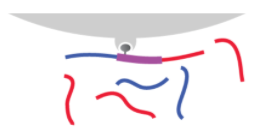
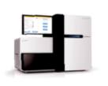
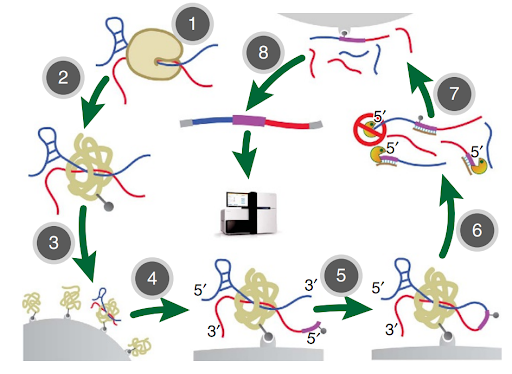
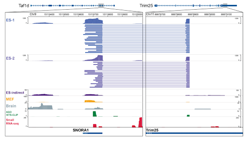

# MARIO (Mapping RNA Interactome in Vivo)

*Group 17: Bonnie Huang, Maya Parish, Jonathon Schorse*

## The Importance of RNA-RNA Interactions

RNA-RNA interactions are a vital part of cell processes including transcription, translation, and regulation of proteins. One of the most famous examples of RNA-RNA interactions is that of mRNA and tRNA during translation. During protein synthesis, tRNA molecules bring amino acids to a growing amino acid chain, while mRNA transcripts act as blueprints1. Another important example of RNA-RNA interactions are miRNA-mRNA interactions. The miRNAs can bind to mRNA and either degrade the mRNA or inhibit translation, playing an important role in protein regulation2. RNA-RNA interactions are also important for RNA splicing. Splicing occurs when introns are removed from the initial RNA, and the exons are joined together to form the mature RNA (mRNA). This process is catalyzed by small nuclear ribonucleoproteins (snRNPs), which are RNA-protein complexes that bind to the introns to be spliced out3. These are just a few examples of important RNA-RNA interactions in cells and there are likely many more of which are still undiscovered. 

An estimated 85% or more of the human genome is believed to be encoded into RNA. Yet, much of the function of the human genome is unknown. Currently, only about 10% of the human genome is well-annotated, with the remaining 90% yet to be fully understood4. In order to better understand RNA-RNA interactions and thus the human genome itself, we must have efficient methods for detecting these interactions. 

Figure 1 : Types of RNA involved in the RNA interactome include: mRNA, tRNA, miRNA, long intergenic noncoding RNA (lincRNA), small nucleolar RNA (snoRNA), small nuclear RNA, transposon RNA, pseudogene RNA, and antisense RNA5. 
.

## What is MARIO?

MARIO (Mapping RNA Interactome in Vivo) is a high throughput method performed *in vivo* used to study RNA-RNA interactions 4. 

Unlike other methods of mapping RNA-RNA interactions, MARIO examines the entire RNA interactome and does not require specific RNA-binding proteins. Older methods of mapping RNA-RNA interactions, such PAR-CLIP and HITS-CLIP, are inefficient because they are unable to study the entire RNA-RNA interactome. This is because they do not assay RNA-RNA interactions directly and instead only examine RNAs that are connected to specific RNA-binding proteins. In contrast, MARIO maps the entire RNA-RNA interactome instead of relying on a single anchoring RNA or protein. Another important advantage of MARIO compared to other RNA-RNA interaction interrogation methods is that it does not require any molecular perturbations, keeping the RNA and proteins closer to their natural state4.

## MARIO Step-by-Step

The following are the steps involved in MARIO4:

**Step 1 - Crosslinking**

The first step is to crosslink the sample using a combination of chemicals and ultraviolet irradiation. Crosslinking preserves RNA-RNA and RNA-protein interactions, and prevents them from coming undone during subsequent steps of MARIO.

**Step 2 - Wash and biotin**

The next step is to perform a strong wash to remove loosely interacting and non-interacting proteins and RNA.

Interacting RNA often features mediating proteins or proteins complexes. In addition to the wash, also add biotin to these interacting complexes. 

**Step 3 - Collect samples on bead**

Adding biotin to our sample allows us to use streptavidin beads to stabilize the interacting materials.

**Step 4 - Introduce RNA linker**

Next, introduce an RNA linker which also contains biotin. In addition, add ligase to the sample to connect this linker to the 5’ end of RNA molecules.

**Step 5 - Connect interacting RNA with linker**

Next, perform ligation once more, to connect the introduced linker to the 3' end of RNA molecules. 

At this point, interacting RNA molecules will be connected by a linker in the middle, allowing us to purify the sample in the next few steps by filtering out molecules missing the linker in the middle. 

**Step 6 - Digest linkers at end of RNA**

In this step, perform purification by introducing exonucleases that digest linkers at the ends of RNA molecules. Linkers in the middle of two RNA molecules will be protected from these particular nucleases and will not be digested. 

**Step 7 - Collect interacting RNA with bead**

At this point, interacting RNA molecules should have a linker containing biotin connecting them together, while non-interacting RNAs should have no such linkers. 

Select for only RNA which has the linker using streptavidin beads to bind to the biotin once again. This gets rid of all the RNA which did not form interactions with other RNA. 

**Step 8 - Reverse transcription and sequencing**

Finally, use reverse transcription to convert the RNA into cDNA, which then allows us to sequence our sample. 

&nbsp;

**Overview of MARIO Steps**

Figure 2 : Overview of all the steps in the MARIO method: 1)Crosslinking, 2)Wash & biotin, 3)Stabilize samples on bead, 4)Introduce linker, 5)Ligate linker, 6)Digest linkers at ends of RNA molecules, 7)Purify RNA with bead, 8)Reverse transcription, 9)Sequencing4

## MARIO Output & Analysis

Performing an alignment from the sequencing data allows us to visualize which parts of the genome the interacting RNA was transcribed from. MARIO tools is a package that is designed specifically for analysis of MARIO paired-end sequencing data4. 

Figure 3 gives an example output of the paired-end sequencing data from MARIO 4. Each line is a sequence representing a pair of RNAs. Overall, this data suggests Taf1d, which is a snoRNA, interacts with Trim25, which is the 3’ UTR of a messenger RNA. The blue reads on top are from one biological replicate and the purple reads on the bottom are from another. Reads from both biological replicates support the interaction between Taf1d and Trim25.

Figure 3 : MARIO paired-end sequencing data4

&nbsp;

Finally, figure 4a shows the results from the application of MARIO assays on two independent mouse embryonic stem cells in order to infer the RNA–RNA interactome in mouse embryonic stem cells 4. The graph on the left shows that tens of thousands of RNA-RNA interactions were identified, and mRNA–snoRNA interactions were the most abundant type. snoRNAs are RNA molecules that guide chemical modifications of other RNAs such as ribosomal RNAs and transfer RNAs. Other common RNA-RNA interactions identified included mRNA–mRNA, mRNA-tRNA, snoRNA-snoRNA, snoRNA-tRNA, and pseudogeneRNA–mRNA interactions. 

Figure 4b shows that there are few RNAs with a high number of interactions and that most RNAs have relatively fewer interactions 4. In other words, there are way more RNAs with specific targets than those with a greater number of targets. This makes sense because for example, there are exponentially more miRNAs that target specific mRNAs than miRNAs that target a large number of mRNAs. 

Figure 4 : Results from application of MARIO to mouse embryonic stem cells4

## References:
[1] Ribosomes, Transcription, and Translation. Nature News. https://www.nature.com/scitable/topicpage/ribosomes-transcription-and-translation-14120660/. Accessed December 15, 2020. 

[2] Ambros V. The functions of animal microRNAs. Nature. 2004;431(7006):350-355. doi:10.1038/nature02871

[3] Clancy, S. (2008) RNA splicing: introns, exons and spliceosome. Nature Education 1(1):31

[4] Nguyen TC, Cao X, Yu P, et al. Mapping RNA–RNA interactome and RNA structure in vivo by MARIO. Nat Commun. 2016;7(1):12023. doi:10.1038/ncomms12023

[5] Chan C, Pham P, Dedon PC, Begley TJ. Lifestyle modifications: coordinating the tRNA epitranscriptome with codon bias to adapt translation during stress responses. Genome Biol. 2018;19(1):228. doi:10.1186/s13059-018-1611-1

