# Statistics Behind Enrichment Analysis of Gene Ontology: Metascape
*Group 20: Yuren Dong, Tianyao Xu, Ziyang Zhang*

*BENG 183 Fall 2020 Final Project*

*University of California, San Diego*

---

## Background
### What is Gene Ontology (GO)?

GO refers to a set of terms that documents the current biological knowledge 
[[1]](https://academic.oup.com/nar/article/47/D1/D330/5160994). There are mainly three areas of GO terms:

 1. **Molecular**: GO terms in this category describe the gene products responsible for molecular functions. GO molecular terms document only what the product would perform without discussing any other contextual information, such as location, timing etc. Molecular GO terms also have varying scope, with some depicting more macroscopic processes, such as *catalytic activity*, and others characterizing more specific functions, such as *adenylate cyclase activity*. 
 2. **Cellular**: GO terms in this category describe the locations where the gene products perform its functions without explaining what the functions are. An example would be *mitochondrion*. 
 3. **Biological Process**: GO terms in this category describe processes that are achieved through coordination of multiple cellular and molecular activities. However, biological process GO terms are not equivalent to a pathway with clearly defined dependencies. An example of this GO term would be *DNA repair*. 

 

### What is a GO graph?
A key advantage of GO terms is that it facilitates organization of GO terms in a loosely hierarchical fashion. A GO term could exert influence over or is the subsidiary of another GO term as defined by the edges. The edges used in GO are “is a”, “part of”, “has part” or “regulates”. Using GO terms and GO edges, users can define dependencies and interactions found in biological pathways. 

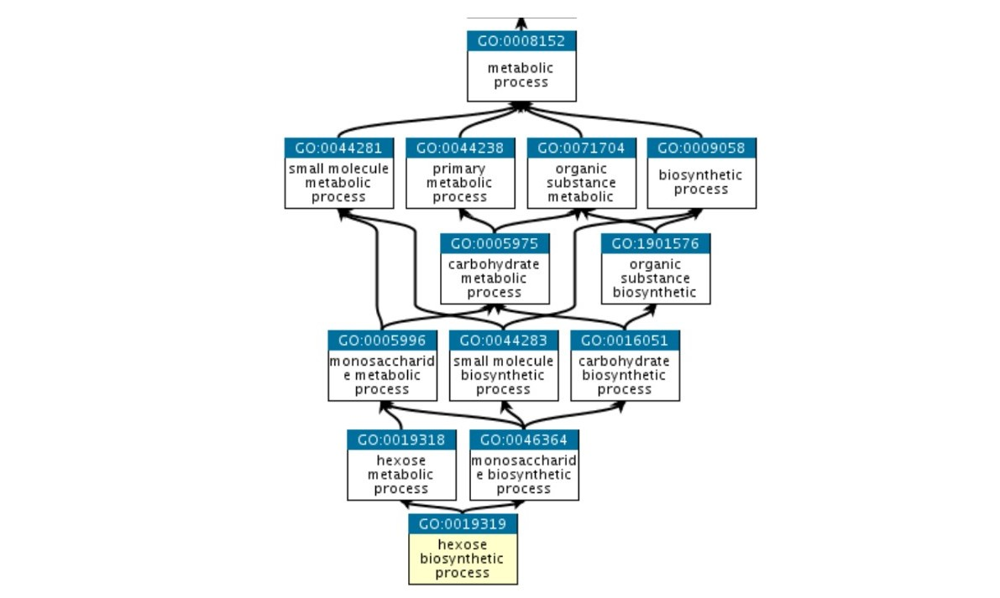

 

### What is Metascape?
[Metascape](https://metascape.org/gp/index.html#/main/step1) is a web portal that takes a list of genes to identify enriched ontology terms. The input is typically a csv or excel file using standard gene naming conventions (left). The output is a list of enriched ontology terms ranked in their significance (bottom right). In addition to GO terms, Metascape also incorporates other ontologies such as KEGG pathways and CORUM complexes. Metascape also provides several enrichment analysis visualizations to better capture the interactions between the ontology terms. The pathway relationship visualization, for example, selects a subset of the enriched terms to create an interactive network using Cytoscape (top right). 

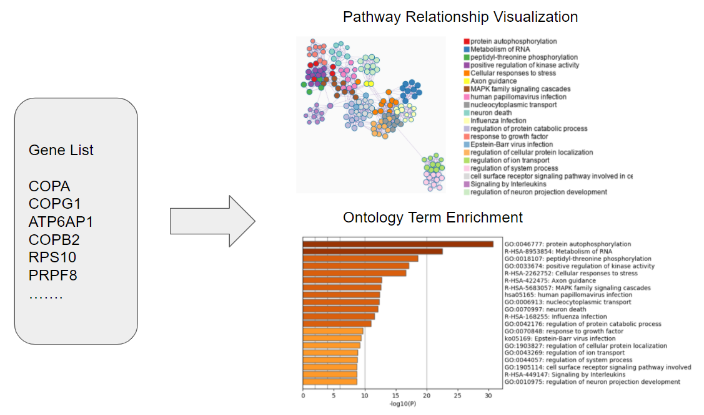

 

### What is Enrichment Analysis? 

Enrichment analysis aims to identify features that are significantly different from its background. Typically, there is a null hypothesis associated with each feature and rejecting the null hypothesis would indicate that this feature is overrepresented or underrepresented. 

A classic and intuitive example to illustrate this test is Fisher's Exact Test. Suppose Professor Johnson wants to investigate whether the proverb *“An apple a day keeps the doctor away”* has any scientific support and managed to get hold of a small student dataset. In this dataset, there are 24 students separated by whether or not they eat apples and whether or not they are sick as shown below.   

|                      | Get sick | Don't get sick |
|----------------------|----------|----------------|
| **Eat apples**       | 11       | 3              |
| **Don't eat apples** | 1        | 9              |

The null hypothesis for this study is that eating apples does not affect the probability of a person getting sick. Without using Fisher's Exact Test, one quick observation can be made: There are significantly more people getting sick when eating apples compared to not eating apples. So logically, eating apples should affect the probability of a person getting sick. Indeed, the Fisher's Exact Test confirms this observation because the associated p-value is below 0.01. This means the null hypothesis can be rejected and that eating apples is overrepresented in people getting sick compared to the background. 

While this simple case is straightforward, performing enrichment analysis with GO terms is more complicated as there are multiple GO terms, each with multiple associated genes, under consideration when computing the p-value. In the next section, we will discuss the statistical method behind Metascape to understand gene set enrichment analysis. 

---

## Enrichment analysis behind Metascape: Hypergeometric Test
As mentioned in the original Metascape paper [[2]](https://www.nature.com/articles/s41467-019-09234-6), for enrichment analysis, it uses the hypergeometric test (an one-sided verion of the Fisher's Exact Test as we are only interested in the enriched GO terms). In this section, let's see how hypergeometric test can be performed within the context of gene ontology enrichment analysis.

 

### Hypergeometric Distribution

The basis of hypergeometric test is hypergeometric distribution. The hypergeometric distribution, as a discrete probability distribution, models the probability of obtaining *k* successes when drawing a sample of size *n* (without replacement) from the entire sample pool of size *N* with *K* successes in total. 

More intuitively, let's imagine that we have an urn with a total of *N* balls inside, where *K* of them are red and *N-K* of them are green. Suppose each time we take exactly *n* balls out of the urn (so that we cannot take the same ball out for more than 1 times; this is called *without replacement*). Hypergeometric distribution gives the probability of having exactly *k* red balls out of the *n* balls we draw from the urn (so that *k* red balls and *n-k* green balls are drawn).

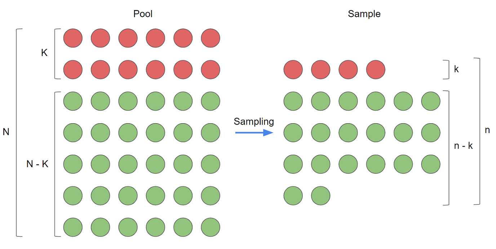

The probability of having exactly *k* red balls drawn from the urn is given by [[3]](https://en.wikipedia.org/wiki/Hypergeometric_distribution):

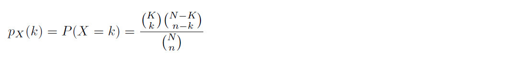

Although the formula may seem complicated, it is not that hard to intuitively understand it:

In the numerator, **K choose k** provides the number of cases where out of the *K* red balls, *k* are selected (in the n balls drawn); **N-K choose n-k** provides the number of cases where out of the *N-K* green balls, *n-k* are drawn. The entire numerator thus calculates the number of cases where we draw *n* balls from the urn and get exactly *k* red balls. 

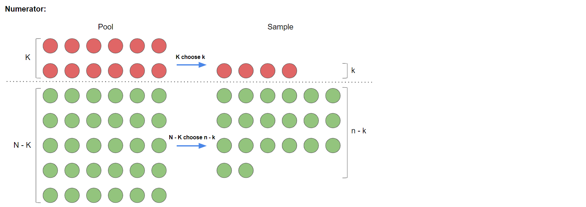

In the denominator, **N choose n** gives the number of cases in total where we simply draw *n* balls out of the urn without caring about how many of them are red. 

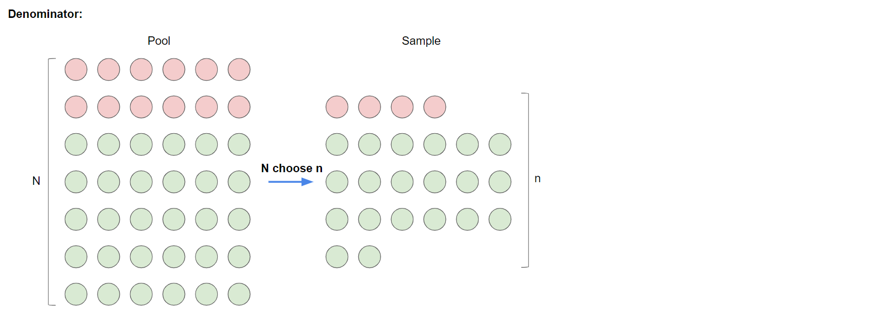

When deviding the numerator using the denominator, we obtain the probability that we take *k* red balls out if we draw *n* balls *without replacement*.

The formulas for the mean and variance of the hypergeometric distribution (together with other information and useful properties) can be found [here](https://en.wikipedia.org/wiki/Hypergeometric_distribution#:~:text=In%20probability%20theory%20and%20statistics,that%20contains%20exactly%20objects%20with), but the probability formula above already provides us enough foundation for the p-value calculations in hypergeometric test.

 

### Hypergeometric Test in Gene Ontology Enrichment Analysis

So how can hypergeometric distribution be used in gene ontology enrichment analyses? To achieve this, let's revisit what gene ontology enrichment analysis aims at. The database has a great number of genes; we have a list of genes, a subset of the entire gene pool in the database, that we are interested in (for instance, differentially expressed genes) from the upstream analyses; each ontology term is a subset of the entire gene pool that is related to some pathways or functions, and we want to find the ontology terms that are highly related to our genes of interest.

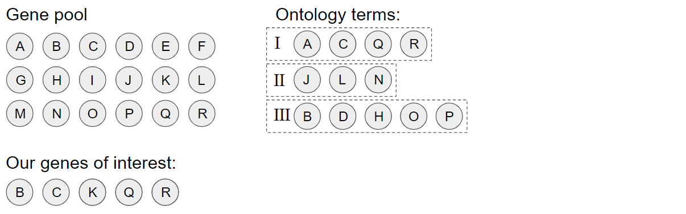

If the following is not already obvious to you, let's view each gene as a ball, where the ones on our gene list are red and the others are green; those balls form the big urn that contains all the balls (the entire gene pool in the database). Each ontology term can be viewed as a sampling from the entire gene pool with some number of genes of interest and others we are not interested in; so each ontology term is a sampling of a certain number of balls from the big urn, where some balls drawn are red and the others are green. For a more related ontology term, it should contain more "red balls"; for a less related ontology term, it should contain less "red balls". In this way, our original question of gene ontology for each ontology term, ***are the genes of interest overrepresented in the ontology term?***, can be equivalently viewed as ***are the red balls overrepresented in this sampling of balls from the urn?***, where the number of red balls can be modeled using the hypergeometric distribution as described above.

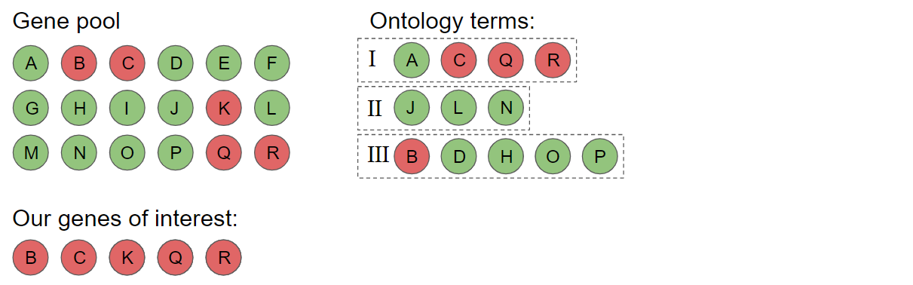

In other words, each time we perform a hypergeometric test, we test one of the ontology terms. Our hypotheses are:

**H0: The ontology term gene set is randomly drawn from the gene pool (the ontology term is not enriched).**

**H1: The ontology term gene set is not randomly drawn from the gene pool and contains a higher proportion of genes of interest than randomly chosen (the ontology term is enriched).**

Now we can use hypergeometric distribution to model the number of genes of interest in the ontology term being tested; this is the basis of hypergeometric test in gene ontology.

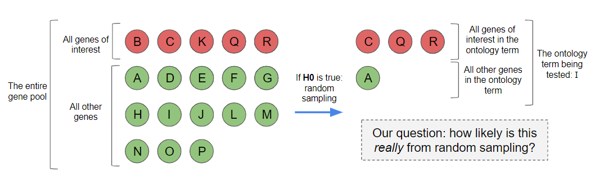

To generalize this situation for p-value calculation, denote:

**N**: ***total number of genes in the entire gene pool*** *(total number of balls before sampling)*

**K**: ***total number of genes of interest*** *(number of red balls before sampling)*

**m**: ***number of genes in the current ontology term*** *(total number of balls after sampling)*

**q**: ***number of genes of interest in the current ontology term*** *(number of red balls after sampling)*

 

To perform the hypergeometric test, we need to calculate a p-value. From how we formulated our null and alternative hypotheses, the p-value can be written as:

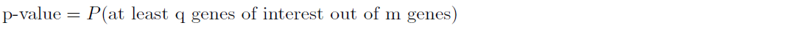

Recall from probability mass function of hypergeometric distribution, with the notations defined, if we want *i* genes of interest in the gene ontology set with the size of *m* genes, the probability is:

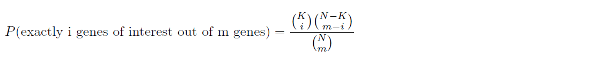

To obtain the p-value, we simply need to add up all the cases where we have at least *q* genes of interest among the *m* genes:

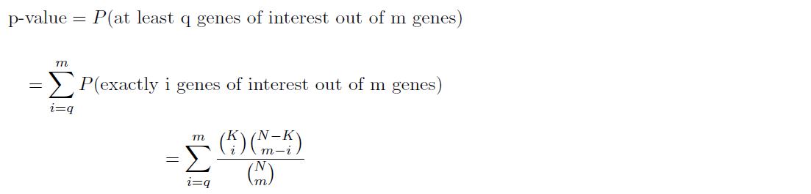

This gives the p-value we want for the hypergeometric test on the ontology term being tested.

*Note: Remember, we perform this test and p-value calculation for each ontology term separately, meaning that we calculate* ***one p-value for each ontology term*** *in this way.*

---

## False discovery rate (FDR) Correction

### Why are we interested in FDR Correction?

In addition to calculating the p-values using hypergeometric test, Metascape also uses the Benjamini-Hochberg p-value correction [[2]](https://www.nature.com/articles/s41467-019-09234-6) to correct the p-values for the multiple hypothesis burden.

While performing multiple hypothesis testings, false positive discoveries would be mis-categorized into positive data by the p-value cutoff method conventionally used for identifying statistically significant results. These false positive data are mixed within the true positive data we want, and need to be filtered out.

Let's take the following graphs as an example. Here we generate 10000 p-values for a GO pathway analysis, where 1680 of them are the true positive GO pathways that are enriched, while 8320 of them are p-values of pathways randomly chosen from the gene pool. We identify a pathway to be enriched if its p-value is less than 0.05, thus there'll be 8320*0.05 = 416 false positive samples.

|                             | Is enriched | Is not enriched |
|----------------------|----------|----------------|
| **From enriched dataset**| 1680       | 0              |
| **From random chosen data** |  416       | 7904              |

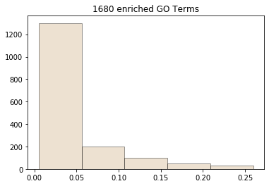
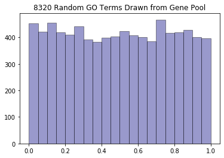

When we combine these two datasets together, we get our original dataset for analysis, which consists of 10000 p-values for different GO pathways, with the overall distribution as following:

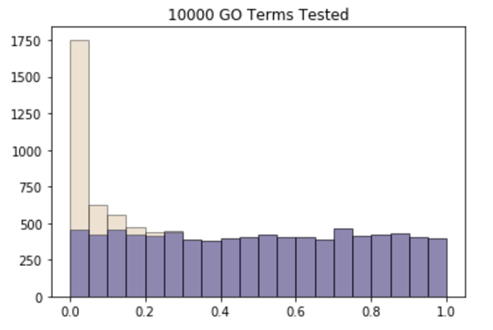

We marked the statistically significant data with red box in the following graph.

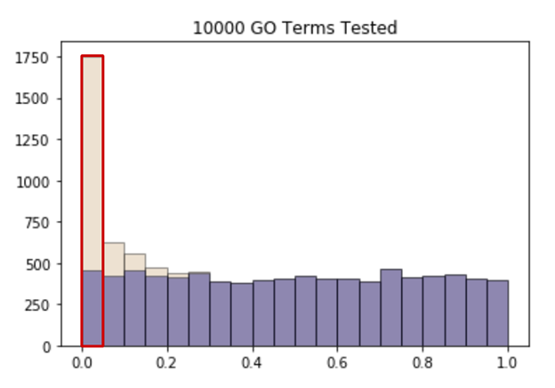

Now we could clearly see that the false positive data selected in the "significant" data are marked purple, and the true positive data are marked light brown. We know that 20% of the enriched pathways are false positive data.

Thus, we need to correct the p-values and get rid of as many false positive data as possible, while still keeping a good amount of true positive data.

 

### Benjamini-Hochberg p-value correction

There're many ways to perform FDR correction; here we'll be mainly introducing the Benjamini-Hochberg method. If interested in the other method (Benjamini/Yekutieli) and mechanisms behind the FDR correction methods, feel free to navigate to the [wikipedia page for FDR correction](https://en.wikipedia.org/wiki/False_discovery_rate).

In the Benjamini-Hochberg p-value correction method, we correct the p-values to adjusted p-values, and we could reselect the statistically significant data (pathways) based on the corrected p-values.

Here is the basic pipeline of performing FDR correction:

1. We would first need to sort our p-values, and we record the rankings of each p-value.

2. We compute the "scaled" p-values following the equation below:
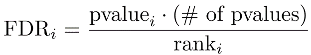

Rank represents the ranking of the p-value we are working on among all the p-values.

*Note: this is not the final FDR adjusted p-value.*

3. Starting from the p-value with second highest ranking and considering original p-values in decreasing (non-increasing) order, we determine the adjusted p-values: for the original p-value of rank *i*, we compare *FDRi* calculated in step (2) with the determined adjusted p-value from the rank *i+1* and pick the smaller value among these two values as the adjusted p-value for rank *i*. 

*Note: for the largest original p-value, we directly use its FDRi as the adjusted p-value*.

Let's take the above 7 GO pathways as an example. We have the p-values from preliminary studies (hypergeometric testing), and now we want to adjust the p-values based on the Benjamini-Hochberg method.

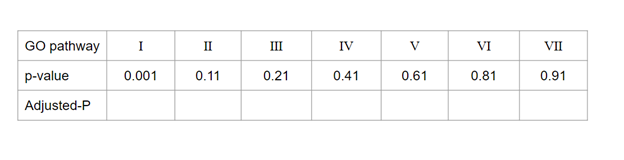

 

Here we present a short gif to show the calculation process of FDR correction through the Benjamini-Hochberg method.

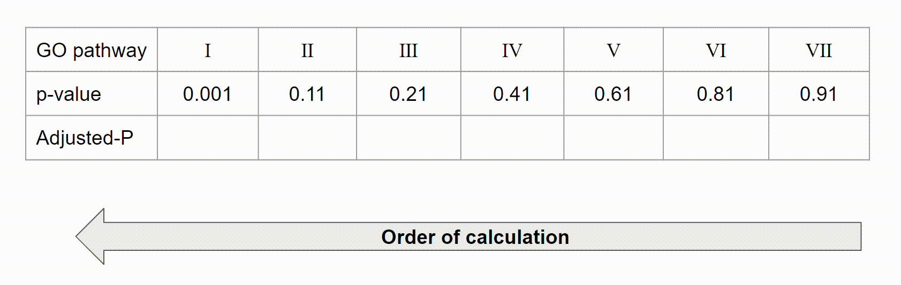

Notice that for GO Pathway VI: the *FDRi* value (0.945) is greater than the adjusted p-value from 1 ranking higher (from Pathway VII, 0.91), thus we would let adjusted p-value of Pathway VI be 0.91.

Conventionally we use FDR corrected p-value < 0.05 as the way to select statistically significant p-values, while eliminating a bunch of false positives. In the example of 7 pathways, we would select Pathway I as the target of downstream analysis.

### Visualization

To give an overview of how FDR correction would affect the selected data, we marked the selected samples by blue in the following graph.

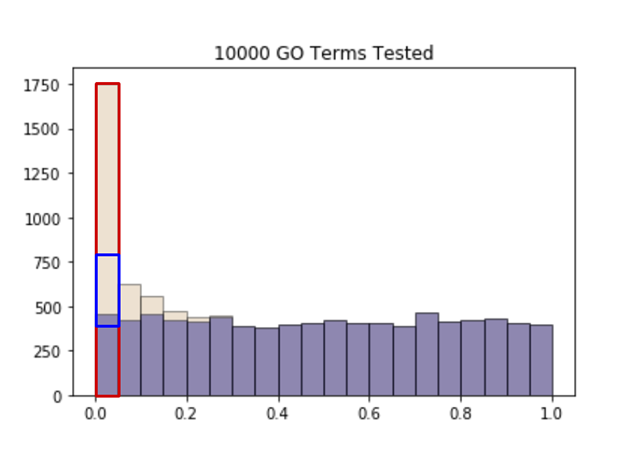

---

## Althernative Methods
While Metascape is friendly to users, especially to those who are unfamiliar with bioinformatic methods, there exist other enrichment analysis tools that demand more previous experience and perform more specialized analysis. Here, two of such tools are selected for discussion. 

 

### The Database for Annotation, Visualization and Integrated Discovery (DAVID) [[4]](https://doi.org/10.1038/nprot.2008.211)

DAVID is a bioinformatics tool with built-in biological databases and various analytical tools to derive biological insights from **large** gene or protein list. Similar to Metascape, DAVID also takes gene lists as inputs and converts them to common gene identifiers. Unlike traditional tools that statistically calculate overrepresented genes, DAVID offers several unique features such as functional annotation clustering and functional group classification, each with their areas of specialization. By incorporating these additional modules, the user can decide which feature to use based on their advantages and disadvantages. 

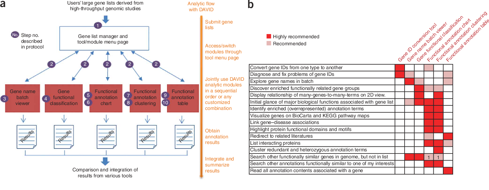

 

### Genomic Regions Enrichment of Annotations Tool (GREAT) [[5]](https://doi.org/10.1038/nbt.1630)

GREAT is a tool specialized in the analysis of enrichment for cis-regulatory elements, which are regions of genome that regulate adjacent genes, on data generated by Massively Parrallel Sequencing, such as ChIP-seq. In addition to hypergeometric test, GREAT also uses binomial test over genomic regions to perform enrichment analysis. Other than ChIP-seq, GREAT can also be applied to open chromatin data, such as ATAC-seq and similar functional datasets. 

---

## Citations
 <!---
Using MLA format
 -->
[1] The Gene Ontology Consortium. “The Gene Ontology Resource: 20 years and still GOing strong.” *Nucleic acids research* vol. 47,D1 (2019): D330-D338. [doi:10.1093/nar/gky1055](https://doi.org/10.1093/nar/gky1055)

[2] Zhou, Yingyao et al. “Metascape provides a biologist-oriented resource for the analysis of systems-level datasets.” *Nature communications* vol. 10,1 1523. 3 Apr. 2019, [doi:10.1038/s41467-019-09234-6](https://doi.org/10.1038/s41467-019-09234-6)

[3] https://en.wikipedia.org/wiki/Hypergeometric_distribution

[4] Huang, Da Wei et al. “Systematic and integrative analysis of large gene lists using DAVID bioinformatics resources.” *Nature protocols* vol. 4,1 (2009): 44-57. [doi:10.1038/nprot.2008.211](https://doi.org/10.1038/nprot.2008.211)

[5] McLean, Cory Y et al. “GREAT improves functional interpretation of cis-regulatory regions.” *Nature biotechnology* vol. 28,5 (2010): 495-501. [doi:10.1038/nbt.1630](https://doi.org/10.1038/nbt.1630)

