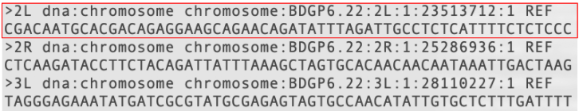
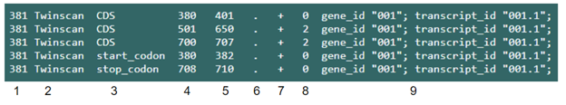
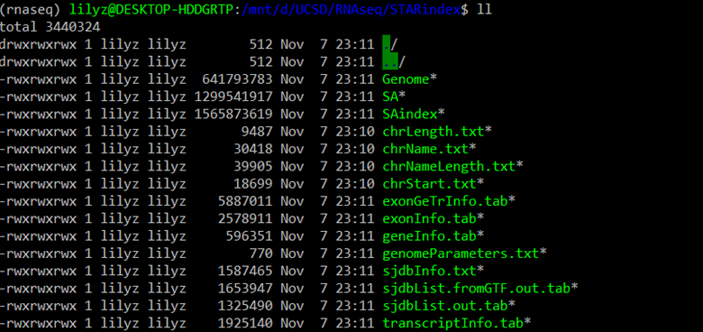
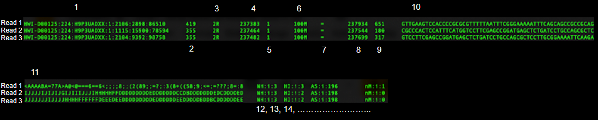
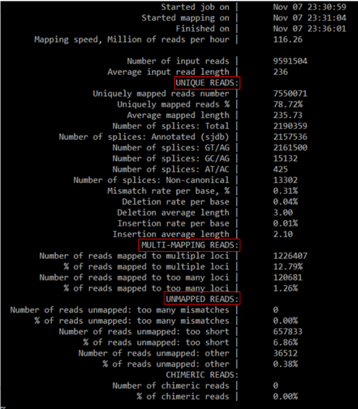
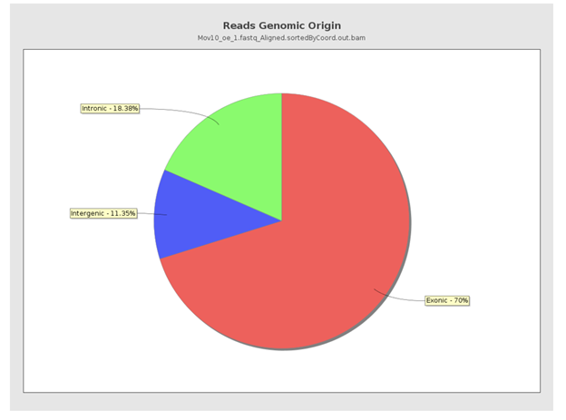
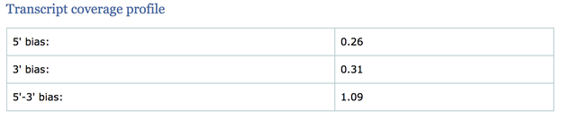

# RNA-seq data analysis pipeline

## Overview
This handout will cover detailed information about how to run each step of the RNA sequencing pipeline and how to interpret the input and output of each step. There are 8 steps in total:
1. Get raw reads data
2. Quality check of the raw reads
3. Clean raw reads
4. Map sequencing reads to genome
5. Alignment quality check
6. Quantify gene expression level
7. Normalize the read counts
8. Differential expression analysis


## Purpose of this pipeline

The ultimate goal is to measure the expression level of multiple genes and compare the expression levels across samples.

## 1. Get raw reads data
The input of this pipeline would be raw sequence data in the form of fastq files. You can obtain fastq files by sequencing your sample of interest, or download fastq files online using GEO/SRA.

[GEO Tutorial](https://www.imm.ox.ac.uk/files/ccb/downloading_fastq_geo)

[SRA Tutorial](https://www.youtube.com/watch?v=JvifigTF4yY)

The fastq file contains multiple sequences, and there will be 4 lines representing each sequence.


1) Line 1 is the sequence id. Note that all sequence id begin with a “@”.
2) Line 2 is the actual sequence read composed of ATGCs.
3) Line 3 is a separator.
4) Line 4 is a sequence of phred quality scores, each corresponding to a base in line 2. For example, the green box shows the score for that base “T” is “G”. The scores are represented in ASCII values, and a greater score means less probability of error, i.e, higher accuracy and higher quality.
The following chars are used to represent phred quality scores:

 ``'!"#$%&'()*+,-./0123456789:;<=>?@ABCDEFGHIJKLMNOPQRSTUVWXYZ[\]^_`abcdefghijklmnopqrstuvwxyz{|}~``

“!” represents the lowest quality (it has the smallest ASCII value) and “~” represents the highest quality.

**Tips:**
Counting the number of reads in a fastq file: Note that “@” can also be the first character of line 4. In other words, all sequence id starts with an “@”, but not all lines starting with “@” is a sequence id. Therefore, do not use grep -c '^@' filename.fq to count the number of reads. Use wc -l filename.fq instead. It will give the number of lines in the file, and you can get the number of reads by dividing that number by 4. The number of reads will also be included in the fastqc report.

## 2.Quality check of the raw reads
The first step is to check the quality of the raw reads using fastqc.
Get help:

`fastqc -h	//gives the description and usage of the fastqc package`

How to run fastqc:

`fastqc file1.fastq file2.fastq`

You can run fastqc on multiple files at a time. After running this command, you can see the progress of the program on the command prompt panel. The program will generate an html report.


_(Screenshot of the HTML report; note that the number of reads is also included in the basic statistics)_

An alternative way of running fastqc is:

`fastqc`

This will open an interactive graphical application in which you can dyamically load fastq files and view their reports. If you are using Ubuntu to run fastqc, you may not be able to run fastqc interactively.


_(Screenshot of the interactive application. [Source](https://www.bioinformatics.babraham.ac.uk/projects/fastqc/
) )_

The fastqc report contains graphs and tables that shows the quality of the input fastq file. The index on the left allows you to jump to a specific graph by clicking on the corresponding link.


Each link corresponds to a test. The color of the bulletin points shows the quality of the corresponding module. Green represents pass, orange represents warning, and red represents failed. Although it seems like that more green bulletin points indicates a file has better quality, the thresholds used by the program may not suit your data, so your data could still have good quality even if it failed several tests. For example, the thresholds to determine the quality of a DNA file and a RNA file should be different, yet fastqc uses the same threshold and therefore produces inaccurate test results.
The following graphs are results from running fastqc on [female_midgut1_R1_raw.fastq.gz](http://sysbio.ucsd.edu/public/wenxingzhao/CourseFall2019/DS_raw/female_midgut1_R1_raw.fastq.gz), which is a RNAseq data of drosophila melanogaster.

#### How to interpret the test results
- Basic statics:
This table gives some simple composition statistics for the analyzed file. Note that for sequence length, it should provide the length of the shortest and longest sequence in the set. In the picture below, it’s only providing one value because all sequences in this file have the same length.


- Per base sequence quality
The plot shows the Phred quality score of each base for all reads (Red: bad; Orange: reasonable; Green: good). The x axis is the position of each base, and the y axis is the Phred quality score. Shown is a good quality graph, whereas the score for most bases are in the green region.


- Per tile sequence quality
This is a heatmap that gives the flow cell quality by individual tiles. The y-axis is a tile, the x axis is a base, and the color is the quality score. Having bright blue for most regions indicates good quality. Other colors indicate there are problems with specific tiles and sequence quality in those regions may be lower. The picture below shows there are potential problems for tile 2215-2305.


- Per base sequence content
This graph shows the percentage of each base (ATCG) at each position of all reads. When analyzing RNA, this test will likely fail or produce warning because the primers used during PCR have arbitrarily chosen sequences. This test will still fail even if we cut the reads, yet in most cases, this won't have much of a negative effect on the following steps in the pipeline.


- Per sequence quality scores
The y-axis is the number of reads, and the x-axis is the mean Phred score of a read. The graph below shows that most reads have high average Phred scores, and thus most reads have high quality.


- Per sequence GC content
Y-axis stands for the number of reads with a GC presentation of x, and x-axis stands for the GC content. Theoretically the distribution should be normal, and any other distribution may indicate contamination or adapter sequences. (This graph shows a bad GC content)


- Per base N content
This graph shows the percentage of undefined base at certain positions among all reads. The following graph shows a good result that has a flat line with y=0. Consider resequencing if y is too high at any position.


- Sequence Length Distribution
X-axis is the length of a read, and y-axis is the number of reads that has length of x. Since we haven’t trimmed the raw reads yet, all the reads should have a length of 125.


- Sequence Duplication Levels
The x-axis shows a sequence is found in the file for how many times, and the y-axis shows the percent of reads with that sequence. High duplication levels could come from adapters, biased enrichment during PCR, or transposons. However, it’s common to have high duplication levels when sequencing RNA since some gene fragments have higher expressions and thus have more duplications. Due to the threshold used by the program, this test will likely fail even the duplication level is expected in this case.


- Overrepresented sequences
This table lists all of the reads that make up more than 0.1% of the total. Overrepresented sequences could result from contamination, unremoved adapters, or genes that are highly significant.


- Adapter content
This graph searches for adapters and shows the location of the adapters. Any line that’s not flat with y=0 indicates there are unremoved adapters.


Based on the above interpretation, although the file failed several tests, it still has
relatively good quality. We don’t need to resequence in this case, but we need to clean the data before mapping it to the genome.

## 3.Clean raw reads

In this step, we will be using fastp to clean the raw data. Specifically, fastp will remove low quality reads and adaptor sequences. Doing so can reduce the chance for a read to be mapped to a wrong position or multiple positions, and thus increase the mapping quality.  [Here](https://github.com/OpenGene/fastp) is a detailed guide about using fastp.

Before running fastp, check if your data is single-end sequenced or paired-end sequenced.
For single sequenced data:

`fastp -i sample_raw.fastq -o sample_clean.fastq -h report_file_name.html //the h flag is optional`

For paired-end sequenced data:

`fastp -i sample_R1_Raw.fastq -I sample_R2_Raw.fastq -o sample_R1_clean.fastq -O sample_R2_clean.fastq -h sample_fastp.html`

After running fastp, it will print a summary on the command prompt, and it will also output the cleaned fastq files and a fastp report to the current folder. Note that for paired sequenced data, it will output 2 cleans files and 1 html report.


You can run fastqc on the cleaned file to see if the quality has improved. Keep in mind that running fastp won’t deal with all the abnormalities and some abnormalities are just meant to be there. You should see the cleaned file passing the adapter content test, but you will also see a warning or fail for the Sequence Length Distribution test. This is because bases are trimmed from the reads and the length of each read will vary depending on how many bases are cut off. Again, passing a test doesn’t necessarily mean good quality.

## 4. Map sequencing reads to genome
\
After cleaning the fastq files, we are going to align the sequenced reads to the reference genome. The alignment process can be performed by several alignment tools, such as STAR and TopHat2. In this handout, we will discuss alignment using STAR(Spliced Transcripts Alignment to a Reference).

#### Input
There are three inputs needed for STAR:
1. A clean fastq file that we obtained from step 2, which contains the sequenced reads
2. A fasta file that contains the reference genome
3. A gtf file that contains gene annotations of the genome in fasta file

An example of FASTA file:\
\
Each two lines in a FASTA file represents one sequence:
1. Line 1 has “>” followed by the sequence ID
2. Line 2 has the actual sequence

An example of GTF file:\
\
There are 9 columns in a GTF file, each column represents a field:
1. **Seqname**: name of the chromosome
2. **Source**: name of the program that generated this annotation
3. **Feature**:  feature type name
4. **Start**: start coordinate of the feature
5. **End**: end coordinate of the feature
6. **Score**: degree of confidence in the existence of the feature (can be replaced by a dot)
7. **Stand**: + (forward) or - (reverse)
8. **Frame**: tells which base is the first base of a codon
  * 0 = first base
  * 1 = second base
  * 2 = third base
9. **Attribute**: semicolon-separated, additional information about the feature

#### Command Line
Prior to alignment, we need to create a genome index. Indexing the genome narrows down the potential origin of the reads within the genome. Therefore, it allows for faster and more efficient mapping.

An example STAR command for building the genome index:
```
STAR --runThreadN 6 \
--runMode genomeGenerate \
--genomeDir chr1_hg38_index \
--genomeFastaFiles /n/groups/hbctraining/intro_rnaseq_hpc/reference_data_ensembl38/Homo_sapiens.GRCh38.dna.chromosome.1.fa \
--sjdbGTFfile /n/groups/hbctraining/intro_rnaseq_hpc/reference_data_ensembl38/Homo_sapiens.GRCh38.92.gtf \
--sjdbOverhang 99
```
* `--runThreadN`: number of threads

* `--runMode`: genomeGenerate mode
* `--genomeDir`: path to store your genome indices (needs to be a folder that already exists)
* `--genomeFastaFile`: path to the input fasta file
* `--sjbdGTFflie`: path to the gtf file
* `--sjdbOverhang`: read length-1 (If the read length varies, the ideal value is the maximum read length-1. In most cases, the default value 100 is sufficient)

The finished genome index folder should look like this:\


After building the index, we can start mapping the sequenced reads to the genome.

An example STAR command for aligning reads:
```
STAR --genomeDir/n/groups/hbctraining/intro_rnaseq_hpc/reference_data_ensembl38/ensembl38_STAR_index/ \
--runThreadN 6 \
--readFilesIn Mov10_oe_1.subset.fq \
--outFileNamePrefix ../results/STAR/Mov10_oe_1_ \
--outSAMtype BAM SortedByCoordinate \
--outSAMunmapped Within \
--outSAMattributes Standard
```

Required parameters:
* `--genomeDir`: path to your genome indices that you created earlier

* `--runThreadN`: number of threads
* `--readFilesIn`: path to fastq file
* `--outFileNamePrefix`: prefix/path for output files

Additional parameters:
* `--outSAMtype`: output filetype (default SAM)
  * SAM is human readable. BAM is in binary format, it is not human readable and it has a smaller size.

* `--outSAMunmapped`: how to handle unmapped reads
* `--outSAMattributes`: specifies SAM attributes. Attributes are each represented by 2 characters

This is not an exhaustive list, more parameters for STAR can be found here: https://urldefense.com/v3/__https://physiology.med.cornell.edu/faculty/skrabanek/lab/angsd/lecture_notes/STARmanual.pdf__;!!Mih3wA!W5aA-ssCAlwRjsoGotPykrxI1YC6digHX7q3H2Zd9juQHfWV9Ad0GYvYdCsZk_Y$

#### Output
There are two important outputs from STAR:
1. A bam file sorted by coordinates
2. A *Log.final.out file that shows the mapping result and quality

We can view the entire BAM file using `samtools view` command, or add `head` command to view only the first couple of lines.\


In a BAM file, each row is one read. There are at least 11 columns in each row that represents 11 tags for each read:
1. **Read name**: name of the query read
2. **Flag**: Combination of bitwise FLAGs that reflects information about reads.
3. **Sequence name**: name of the reference sequence that the read is aligned to
  * e.g. 2R = R arm of chromosome 2
4. **Position**: the mapping position of the first matching base
  * e.g. for Read 1, 237934 = 237,934th base of R arm of chromosome 2
5. **Mapping quality**: Phred scaled quality number of the mapping
  * e.g. 10  = probability of incorrect mapping is 1 in 10
  * e.g. 20 = probability of incorrect mapping is 1 in 100
  * 255 = mapping quality unavailable
6. **CIGAR string**: tells us if the query read is a perfect match to the reference sequence or not
  * e.g. 100M = the read has 100bp and matches perfectly
7. **Mate name**: Sequence name of the mate read, “=” means it is identical to this read
8. **Mate position**: the mapping position of the mate read
9. **Template length**: the distance from the leftmost to the rightmost mapped base of mate reads
10. **Read sequence**: sequence of the query read
11. **Read quality**: ASCII quality of the query read

There may be extra columns that represent extra tags, such as 12, 13, 14, and 15 here that each represents a SAM attribute.


## 5.Alignment Quality Check
\
Mapping algorithms may cause biases to the alignment, so it is important to check the mapping quality. There are two ways for us to do a quality check:
1. Log.final.out file
2. Qualimap

#### Log.final.out
*Log.final.out is the second output from STAR. We can view it using `less` command.\


The *Log.final.out file tells us the mapping statistics about:
1. Unique reads
2. Multi-mapping reads
3. Unmapped reads
A good quality mapping expects a large proportion of reads to be uniquely mapped, and small or no proportion to be multi-location mapped or unmapped.

#### Qualimap
Qualimap is a java application that analyzes mapping results. It uses BAM files as input and HTML reports as output.

An example Qualimap command:
```
$ qualimap rnaseq \
-outdir results/qualimap/Mov10_oe_1 \
-a proportional \
-bam results/STAR/Mov10_oe_1_Aligned.sortedByCoord.out.bam \
-p strand-specific-reverse \
-gtf /n/groups/hbctraining/intro_rnaseq_hpc/reference_data_ensembl38/Homo_sapiens.GRCh38.92.1.gtf \
--java-mem-size=8G
```
Parameters:
* `-outdir`: output directory
* `-a`: Counting algorithm
  * Uniquely mapped reads(default)
  * Proportional: multi-mapped reads are counted multiple times
* `-bam`: path to the bam file

* `-p`: sequencing library protocol
  * Strand specific forward
  * Strand specific reverse
  * Non strand specific(default)
* `-gtf`: path to the gtf file used in STAR alignment
* `--java-mem-size`: set Java memory size

The output HTML report of Qualimap organizes the mapping statistics into charts and graphs, including some that we are particularly interested for quality checking:
1. Reads alignment
2. Reads genomic origin
3. Transcript coverage profile

\
Like how we analyzed the statistics in the *Log.final.out file, higher percentage of mapped reads and smaller percentage of multi-location mapped or unmapped reads indicates higher mapping quality.

\
Higher proportion of reads mapped to exonic regions and lower proportion of reads mapped to intronic regions indicates higher mapping quality.


* 5’ bias: mean coverage at the 5’ region/mean coverage of the whole transcript
* 3’ bias: mean coverage at the 3’ region/mean coverage of the whole transcript
* 5’-3’ bias: 5’ bias/3’ bias
A 5’-3’ bias close to 1 indicates less bias and higher mapping quality.


## 6. Quantify gene expression level

After the reads are aligned to the specific locations of the genome, you should obtain a bam file sorted by coordinates which will be used to count how many reads are mapped to each gene. In order to summarize the reads abundance for each gene, we will use *featureCounts* as the tool for this quantification step.

An example command for using *featureCounts* would be look like this:
```
featureCounts -p
-a /mnt/d/RNAseq/Drosophila_melanogaster.BDGP6.22.97.chr.gtf
-T 10
-o F_midgut1_count.txt
F_midgut1_Aligned.sortedByCoord.out.bam
```
Parameters:
* `-p` Check if paired-end distance is valid
* `-a /mnt/d/RNAseq/Drosophila_melanogaster.BDGP6.22.97.chr.gtf` Specify the path to the GTF file
* `-T 10` Specify 10 cores
* `-o F_midgut1_count.txt` Specify the name of the text output; can also specify the path for this text output by adding the specific path after -o. Ex. -o /mnt/d/RNAseq/F_midgut1_count.txt
* `F_midgut1_Aligned.sortedByCoord.out.bam` The bam file we want to quantify gene expression on and is also the input.

After inputting these commands with *featureCounts*, you should obtain the output which consists of two files: a count matrix (text file) and a summary file.


You can use either `less` or `cat` to open the summary file.

The summary file shows the number of reads “assigned” to the gene and the reason they remained “unassigned”.

An example of the result of using `cat` to open the summary file.


## 7. Normalize the read counts

Once a gene’s expression is quantified by *featureCounts*, the most common application is to compare the gene expression in different conditions. Through this comparison, we may identify the genes that might be responsible for a disease or developmental issue. Since library size and gene length may vary between samples, we need to take these factors into account before making comparisons. The goal of this step is to normalize the quantification result.

To normalize the result of quantification, we could use RPKM/FPKM (reads/fragments per kilobase of million reads) or TPM (transcripts per million).

The formulas for RPKM, FPKM, and TPM are as follows:


RPKM is used for single-end RNA-seq in which every read corresponds to a single fragment whereas FPKM is used for paired-end RNA-seq in which two reads correspond to a single fragment. By looking at the formulas, RPKM and FPKM normalize the library size first and then normalize the gene lengths, whereas TPM normalizes the gene lengths first. This normalized TPM value is then divided by the sum of the normalized values and multiplied by 10^6. Therefore, the sum of TPMs are the same for each library and it is easier to interpret results from TPM than RPKM/FPKM.


## 8. Differential expression analysis

Differential expression analysis determines the quantitative changes in gene expression between samples. We can test numerous hypotheses against the null hypothesis that genomic activities are the same in two different conditions. *DESeq2* is the tool that we will use to accomplish this statistical testing. *DESeq2* uses a statistical model that assumes the read counts of each gene are from negative binomial distribution. It also uses an accurate dispersion estimates to obtain precise variance for differential expression testing. The environment for running *DEseq2* is by using R.

Overall workflow of *DESeq2*:
* One of the inputs of DESeq2 is the read count table (text file) from *featureCounts* without normalization because the first step in DESeq2 is to normalize the read counts for library size and gene length.


* For each gene, a dispersion estimate is calculated, which determines the variance of gene expression.
* Then the model fits a line across the dispersion estimates of all genes versus the mean of normalized counts.
* The dispersion estimates are shrunk toward the fitted line to generate more accurate dispersion estimates as indicated by this example picture.


* Considering confounding variables related to the experiment such as temperature, treatment, and age, a generalized linear model can be generated.
* Lastly, the statistical testing portion in differential expression that contrasts alternative hypothesis (ex. treated) versus null hypothesis (ex. untreated) is carried out and the output is a list of differentially expressed genes.

1. Three inputs that are required for using *DESeq2*:
	* **Read count matrix** (`countData`) Must be raw read counts without normalization. The rows represent features (ex. genes) and columns represent which sample the reads come from. The values in rows and columns represent the number of reads that have been mapped to the gene.
	* **Column Data** (`colData`) Describes the experimental design of the columns.
	* **Design formula** (`designFormula`) Determines what are the controls and what are factors to test during differential expression testing.

	An example of a `countData` and a `colData`:


2. Create a DESeq dataset (DDS) object to run *DESeq2*:
	```
	dds <- DESeqDataSetFromMatrix(countData = countDataName, colData = columnDataName, design = as.formula(designFormulaName))
	```

3. Run *DESeq2* and return the DESeqDataSet object:
	```
	dds <- DESeq(dds)
	```
	where `dds` is what has been created in previous step

4. To obtain result:
	```
	DEresults <- results(dds)
	```
An example of result table:


Feature explanations: \
**baseMean** Average of normalized gene expression \
**log2FoldChange** To what extent a gene has changed or differentially expressed due to alternative hypothesis (treatment) \
**lfcSE** Standard error estimate of log2 fold change \
**stat** Statistic that is calculated and is then translated into pvalue and padj \
**pvalue** Confidence on the log2 fold change and if a gene is differentially expressed \
**padj** Adjusted p-value

### Visualize differentially expressed genes

We can visualize the result from *DESeq2* by using plots so that we are able to gain more confidence about the quality of the data and the experimental design.

* Plot MA plot using `plotMA()` function:
	```
	plotMA(DEresults)
	```

MA plot tells us whether the data are normalized well for *DESeq2*. The x-axis is the average of normalized read counts and the y-axis is the log fold change. Most genes are not expected to be differentially expressed so these genes are expected to be on the horizontal 0 line.

An example of a MA plot:


Moreover, in order to visualize the actual expression of differentially expressed genes, we can use heatmap in which the values in the matrix are represented as colors. The `heatmap()` function takes in a matrix with only numeric values. The heatmap can also be normalized based on either column or row.

* To generate heatmap using `heatmap()` function and using `scale` to normalize if needed:
	```
	heatmap(DEresults, scale = “column/row”)
	```

* To generate heatmap without dendrograms, use `Colv` and `Rowv`:
	```
	heatmap(DEresults, Colv = NA, Rowv = NA, scale = “column/row”)
	```

An example of a heatmap:


### Reference
Lecture 7 slides

https://hbctraining.github.io/Intro-to-rnaseq-hpc-O2/lessons/03_alignment.html

https://hbctraining.github.io/Intro-to-rnaseq-hpc-salmon/lessons/03_QC_STAR_and_Qualimap_run.html

https://mblab.wustl.edu/GTF22.html

http://samtools.github.io/hts-specs/SAMv1.pdf

https://physiology.med.cornell.edu/faculty/skrabanek/lab/angsd/lecture_notes/STARmanual.pdf

http://www.cpwardell.com/2015/02/24/understanding-bam-files-part-1/

http://www.incodom.kr/Expression_profiling

https://bioinfo.umassmed.edu/content/pdf2016fall/normalization.pdf

https://4va.github.io/biodatasci/r-rnaseq-airway.html

https://www.r-graph-gallery.com/215-the-heatmap-function.html

https://hbctraining.github.io/Intro-to-rnaseq-hpc-O2/lessons/05_counting_reads.html

https://github.com/Irenexzwen/BIOE183/blob/master/Tutorial4_DE.md

https://compgenomr.github.io/book/gene-expression-analysis-using-high-throughput-sequencing-technologies.html#quantification

https://compgenomr.github.io/book/gene-expression-analysis-using-high-throughput-sequencing-technologies.html#differential-expression-analysis
